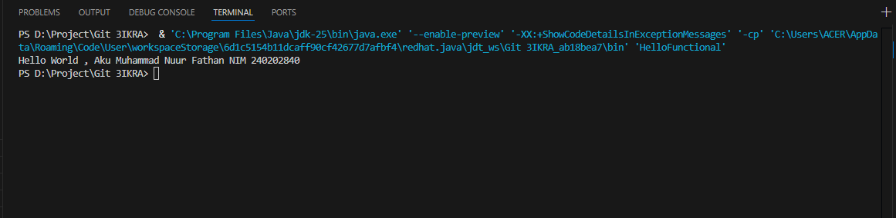
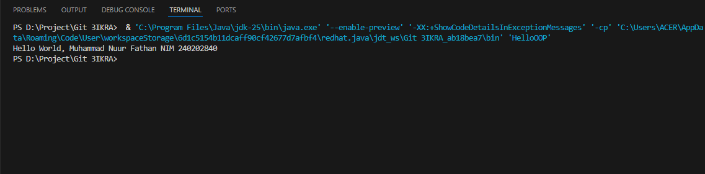
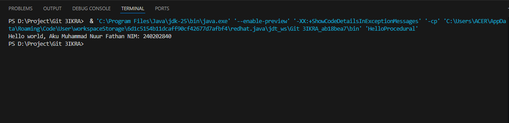

# Laporan Praktikum Minggu 1 
Topik: [WEEK 1 – Setup Hello POS]

## Identitas
- Nama    : [Muhamamd Nuur Fathan]
- NIM     : [240202840]
- Kelas   : [3IKRA]

---

## Tujuan
1. Mahasiswa memahami konsep dasar 3 paradigma pemrograman: Prosedural, OOP, dan Fungsional.
2. Mahasiswa mampu membuat program sederhana untuk menampilkan output ke terminal menggunakan ketiga paradigma.
3. Mahasiswa memahami perbedaan pendekatan tiap paradigma dalam menyelesaikan masalah sederhana.
4. Mahasiswa mampu melakukan setup project Java awal untuk studi kasus Agri-POS.
---

## Dasar Teori
A. Prosedural adalah paradigma pemrograman yang menjalankan instruksi langkah demi langkah melalui fungsi utama.

B. OOP (Object-Oriented Programming) berorientasi pada object yang memiliki atribut (data) dan method (perilaku).

C. Fungsional menekankan penggunaan fungsi murni, lambda expression, dan immutability untuk menulis kode yang ringkas.

D. Class & Object: class adalah cetak biru, object adalah hasil nyata dari instansiasi class.

E. Enkapsulasi dan modularisasi dalam OOP membuat kode lebih terstruktur, maintainable, dan scalable.

---

## Langkah Praktikum
1. Menyiapkan lingkungan project Java untuk praktikum.
2. Membuat program sederhana menggunakan paradigma **prosedural**, **fungsional**, dan **OOP**.
3. Melakukan kompilasi dan menjalankan program untuk menampilkan output di terminal.
4. Membandingkan hasil eksekusi dari tiap paradigma.
5. Melakukan commit dengan pesan sesuai tahapan:

   * `Initial commit - setup Hello POS (procedural)`
   * `Add HelloFunctional.java (functional)`
   * `Add HelloOOP.java (object oriented)`

---

## Kode Program
### 1. Procedural

```java
public class HelloProcedural {
   public static void main(String[] args) {
      String nim = "240202840";
      String nama = "Muhammad Nuur Fathan";
      System.out.println("Hello world " + nama + ", nim: " + nim);
   }
}
```

### 2. Functional

```java
import java.util.function.BiConsumer;

public class HelloFunctional {
    public static void main(String[] args) {
        BiConsumer<String, Integer> sapa =
            (nama, nim) -> System.out.println("Hello World, " + nama + " nim " + nim);

        sapa.accept("Muhammad Nuur Fathan", 240202840);
    }
}
```

### 3. OOP

```java
public class HelloOOP {
    static class Mahasiswa {
        String nama;
        String NIM;

        Mahasiswa(String n, String u) { 
            nama = n;
            NIM = u;
        }

        void sapa() {
            System.out.println("Hello World, " + nama + " NIM " + NIM);
        }
    }

    public static void main(String[] args) {
        Mahasiswa m = new Mahasiswa("Muhammad Nuur Fathan", "240202840");
        m.sapa();
    }
}

```

---

## Hasil Eksekusi

**HelloFunctional**  


---

**HelloOPP**  


---

**HelloProcedural**


---
---

## Analisis
Dari ketiga implementasi di atas terlihat perbedaan paradigma:

* **Procedural**: semua logika langsung ditulis di fungsi `main`. Sederhana, cepat dibuat, tetapi sulit diorganisir untuk program besar.
* **Functional**: menggunakan `BiConsumer` dengan lambda expression. Lebih ringkas, mengurangi boilerplate code, dan mudah digunakan dalam konteks data processing atau parallel computing. Namun, masih kurang intuitif jika dipakai untuk sistem besar yang punya banyak entitas.
* **OOP**: membagi program menjadi **class** dan **object**. Contoh class `Mahasiswa` menyimpan data dan method `sapa()`. Pendekatan ini sangat cocok untuk sistem skala besar seperti POS (Point of Sales), karena setiap entitas (Produk, Transaksi, Pelanggan) bisa dimodelkan sebagai object dengan atribut dan perilaku masing-masing.

---

## Kesimpulan
* Praktikum minggu ini berhasil memperlihatkan perbedaan **tiga paradigma pemrograman** dalam Java.
* **Prosedural** sederhana tapi sulit berkembang.
* **Functional** menawarkan cara ekspresif dan ringkas, cocok untuk data processing.
* **OOP** adalah pendekatan yang paling sesuai untuk sistem kompleks karena mendukung modularisasi, enkapsulasi, serta memungkinkan pengembangan berkelanjutan.
* Dengan memahami ketiga paradigma ini, mahasiswa dapat lebih fleksibel dalam memilih pendekatan yang sesuai dengan kebutuhan sistem yang akan dibangun.

---

## Quiz
1. **Apakah OOP selalu lebih baik dari prosedural?**
   Tidak. OOP memang lebih baik untuk proyek berskala besar karena menyediakan modularitas, enkapsulasi, dan kemudahan pemeliharaan. Namun, prosedural masih unggul dalam hal kesederhanaan dan performa untuk program kecil, misalnya skrip otomatisasi atau perhitungan sederhana. Jadi, pilihan paradigma bergantung pada kompleksitas masalah: OOP memberikan struktur, tetapi juga menambah beban kognitif serta boilerplate ketika dipakai pada program yang sangat kecil.

2. **Kapan functional programming lebih cocok digunakan dibanding OOP atau prosedural?**
   Functional programming lebih cocok ketika kita mengolah data dalam jumlah besar, melakukan operasi matematis yang kompleks, atau ingin menulis program yang mudah diparalelkan. Karena functional programming mengutamakan fungsi murni (pure function) dan menghindari efek samping (side effects), hasilnya lebih prediktif serta mudah diuji. Misalnya, aplikasi big data, machine learning pipeline, atau sistem dengan komputasi paralel akan lebih efektif menggunakan paradigma fungsional dibanding OOP atau prosedural.

3. **Bagaimana paradigma memengaruhi maintainability dan scalability aplikasi?**

   Prosedural: mudah dipahami di awal, tetapi ketika program berkembang besar, logika bercampur sehingga sulit dipelihara. Maintainability rendah, scalability terbatas.

   OOP: lebih mudah di-maintain karena kode dipisah menjadi class dan object. Skalabilitas tinggi, terutama jika menggunakan prinsip SOLID dan desain pattern.

   Fungsional: maintainability cukup tinggi karena sifat stateless dan immutable, mengurangi bug akibat perubahan data. Skalabilitas bagus untuk aplikasi data-intensive, tetapi tidak selalu intuitif jika digunakan untuk sistem berbasis objek nyata.

4. **Mengapa OOP lebih cocok untuk aplikasi POS dibanding prosedural?**
   POS (Point of Sales) terdiri dari banyak entitas seperti Produk, Pelanggan, Transaksi, dan Inventori. Dengan OOP, setiap entitas bisa direpresentasikan sebagai class dengan atribut dan perilaku masing-masing. Hal ini memudahkan pemodelan dunia nyata ke dalam kode. Selain itu, OOP mendukung fitur pewarisan (inheritance), polimorfisme, dan enkapsulasi, yang membuat pengembangan aplikasi lebih fleksibel, terstruktur, serta lebih mudah di-maintain ketika kebutuhan bisnis bertambah atau berubah.

5. **Bagaimana paradigma fungsional membantu mengurangi boilerplate code?**
   Paradigma fungsional memanfaatkan konsep seperti lambda expression, higher-order function, dan function composition yang memungkinkan developer menulis kode lebih ringkas. Daripada menulis loop panjang atau class tambahan, developer cukup mendefinisikan fungsi sekali lalu digunakan kembali di berbagai konteks. Karena data bersifat immutable, developer juga tidak perlu menambahkan banyak logika kontrol untuk menjaga konsistensi state. Akhirnya, kode jadi lebih singkat, modular, dan bebas dari duplikasi berlebihan
