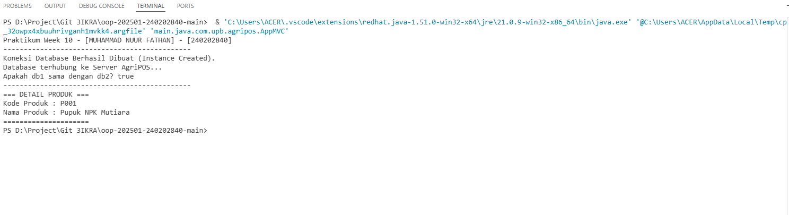
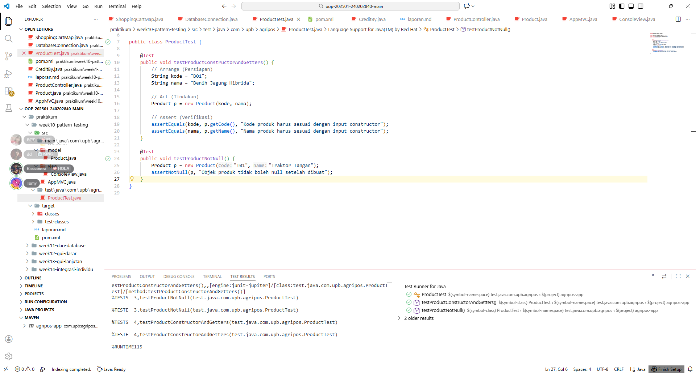

# Laporan Praktikum Minggu 1 (sesuaikan minggu ke berapa?)
Topik: [Design Pattern (Singleton, MVC) dan Unit Testing menggunakan JUnit]

## Identitas
- Nama  : [Muhammad Nuur Fathan]
- NIM   : [240202840]
- Kelas : [3IKRA]

---

## Tujuan
1. Menjelaskan konsep dasar design pattern dalam rekayasa perangkat lunak.
2. Mengimplementasikan **Singleton Pattern** untuk menjamin tunggalnya instance koneksi database.
3. Menerapkan arsitektur **MVC (Model-View-Controller)** pada fitur Produk.
4. Membuat dan menjalankan **Unit Test** sederhana menggunakan library JUnit.
5. Menganalisis manfaat penerapan design pattern dan testing terhadap kualitas kode.

---

## Dasar Teori
1. **Singleton Pattern**: Merupakan design pattern yang memastikan sebuah class hanya memiliki satu instance (objek) selama aplikasi berjalan dan menyediakan satu titik akses global (biasanya melalui method `static getInstance`).
2. **MVC (Model-View-Controller)**: Konsep arsitektur yang memisahkan aplikasi menjadi tiga komponen utama:
   - *Model*: Menangani data dan logika bisnis.
   - *View*: Menangani tampilan output ke pengguna.
   - *Controller*: Menghubungkan interaksi antara Model dan View.
3. **Unit Testing**: Metode pengujian perangkat lunak di mana bagian terkecil dari kode (unit/method) diuji secara terisolasi untuk memastikan fungsinya berjalan sesuai harapan. Framework yang digunakan adalah **JUnit**.

---

## Langkah Praktikum
1. **Setup Project**: Membuat struktur project Maven dan mengatur `pom.xml` untuk menambahkan dependensi **JUnit 5** serta menyesuaikan versi Java (Compiler Release 21).
2. **Implementasi Singleton**: Membuat class `DatabaseConnection` dengan constructor `private` dan method `static` untuk inisialisasi instance.
3. **Implementasi MVC**:
   - Membuat `Product.java` (Model).
   - Membuat `ConsoleView.java` (View).
   - Membuat `ProductController.java` (Controller).
4. **Implementasi Unit Test**: Membuat class `ProductTest.java` di folder `src/test` untuk menguji fungsi getter dan constructor pada Model.
5. **Eksekusi**: Menjalankan aplikasi utama (`AppMVC`) dan menjalankan Unit Test melalui VS Code/Maven.

---

## Kode Program
### 1. DatabaseConnection.java

```java
package main.java.com.upb.agripos.config;

public class DatabaseConnection {
    // 1. Static variable untuk menyimpan satu-satunya instance
    private static DatabaseConnection instance;

    // 2. Constructor private agar tidak bisa di-new dari luar
    private DatabaseConnection() {
        System.out.println("Koneksi Database Berhasil Dibuat (Instance Created).");
    }

    // 3. Static method untuk mengambil instance (Lazy Initialization)
    public static DatabaseConnection getInstance() {
        if (instance == null) {
            instance = new DatabaseConnection();
        }
        return instance;
    }

    // Contoh method fungsionalitas
    public void connect() {
        System.out.println("Database terhubung ke Server AgriPOS...");
    }
}

```
### 2. ProductController.java
```java
package main.java.com.upb.agripos.controller;

import main.java.com.upb.agripos.model.Product;
import main.java.com.upb.agripos.view.ConsoleView;

public class ProductController {
    private final Product model;
    private final ConsoleView view;

    // Constructor Injection
    public ProductController(Product model, ConsoleView view) {
        this.model = model;
        this.view = view;
    }

    public void updateView() {
        view.displayProductDetails(model.getCode(), model.getName());
    }

    public void showCustomMessage(String msg) {
        view.showMessage(msg);
    }
}
```
### 3. Product.java
```java
package main.java.com.upb.agripos.model;

public class Product {
    private final String code;
    private final String name;

    public Product(String code, String name) {
        this.code = code;
        this.name = name;
    }

    public String getCode() {
        return code;
    }

    public String getName() {
        return name;
    }
}
```
### 4. ConsoleView.java
```java
package main.java.com.upb.agripos.view;

public class ConsoleView {
    public void showMessage(String message) {
        System.out.println(message);
    }

    public void displayProductDetails(String code, String name) {
        System.out.println("=== DETAIL PRODUK ===");
        System.out.println("Kode Produk : " + code);
        System.out.println("Nama Produk : " + name);
        System.out.println("=====================");
    }
}
```
### 5. AppMVC.java
```java
package main.java.com.upb.agripos;

import main.java.com.upb.agripos.config.DatabaseConnection;
import main.java.com.upb.agripos.controller.ProductController;
import main.java.com.upb.agripos.model.Product;
import main.java.com.upb.agripos.view.ConsoleView;

public class AppMVC {
    public static void main(String[] args) {
        // Ganti dengan Nama dan NIM asli kamu
        System.out.println("Praktikum Week 10 - [MUHAMMAD NUUR FATHAN] - [240202840]"); 
        System.out.println("----------------------------------------------");

        // 1. Test Singleton Pattern
        // Panggilan pertama (Object dibuat)
        DatabaseConnection db1 = DatabaseConnection.getInstance();
        db1.connect();

        // Panggilan kedua (Menggunakan object yang sama, constructor tidak jalan lagi)
        DatabaseConnection db2 = DatabaseConnection.getInstance();
        
        System.out.println("Apakah db1 sama dengan db2? " + (db1 == db2)); // Harus true
        System.out.println("----------------------------------------------");

        // 2. Test MVC Pattern
        Product product = new Product("P001", "Pupuk NPK Mutiara");
        ConsoleView view = new ConsoleView();
        ProductController controller = new ProductController(product, view);

        controller.updateView();
    }
}
```
### 6. ProductTest.java
```java
package test.java.com.upb.agripos;

import main.java.com.upb.agripos.model.Product;
import org.junit.jupiter.api.Test;
import static org.junit.jupiter.api.Assertions.*;

public class ProductTest {

    @Test
    public void testProductConstructorAndGetters() {
        // Arrange (Persiapan)
        String kode = "B01";
        String nama = "Benih Jagung Hibrida";
        
        // Act (Tindakan)
        Product p = new Product(kode, nama);

        // Assert (Verifikasi)
        assertEquals(kode, p.getCode(), "Kode produk harus sesuai dengan input constructor");
        assertEquals(nama, p.getName(), "Nama produk harus sesuai dengan input constructor");
    }

    @Test
    public void testProductNotNull() {
        Product p = new Product("T01", "Traktor Tangan");
        assertNotNull(p, "Objek produk tidak boleh null setelah dibuat");
    }
}

```
---

## Hasil Eksekusi
Running AppMVC 



Running JUnit


---

---

## Analisis

1. **Singleton Pattern**:
Pada kode `DatabaseConnection`, konstruktor dibuat `private`. Hal ini memaksa class lain untuk mengakses objek hanya melalui `DatabaseConnection.getInstance()`. Saat program dijalankan, pesan "Koneksi Database Berhasil Dibuat" hanya muncul satu kali meskipun `getInstance()` dipanggil berkali-kali, membuktikan bahwa objek yang digunakan adalah objek yang sama (efisiensi memori).
2. **MVC Architecture**:
Pemisahan kode terlihat jelas. Class `Product` hanya berisi data, `ConsoleView` hanya berisi perintah `System.out.println`, dan logika penggabungannya ada di `ProductController`. Pendekatan ini membuat kode lebih rapi dibandingkan menulis semua logika di dalam `main`.
3. **Unit Testing & Kendala**:
Dalam pengujian `ProductTest`, fungsi `assertEquals` memastikan data yang dimasukkan ke konstruktor sama persis dengan yang dikembalikan oleh *getter*.
**Kendala:** Sempat terjadi error *version mismatch* (Java 17 vs Java 21) pada Maven.
**Solusi:** Mengubah konfigurasi `pom.xml` pada bagian `<maven.compiler.release>` menjadi `21` dan melakukan *Reload Project* agar VS Code mengenali versi JDK yang terinstall.

---


## Kesimpulan
Penerapan **Design Pattern** seperti Singleton dan MVC sangat membantu dalam mengorganisir kode agar lebih terstruktur, mudah dibaca, dan efisien dalam penggunaan memori. Selain itu, **Unit Testing** dengan JUnit memberikan jaminan bahwa logika dasar aplikasi (seperti Model) berjalan dengan benar sebelum fitur tersebut digunakan dalam skala yang lebih besar, sehingga potensi *bug* dapat dikurangi sejak dini.

---

## Quiz
1. **Mengapa constructor pada Singleton harus bersifat private?**
**Jawaban:** Agar class lain tidak dapat membuat instance (objek) baru secara langsung menggunakan operator `new`. Ini memaksa penggunaan method statis `getInstance()` untuk mengontrol agar hanya ada satu objek yang tercipta dalam memori.
2. **Jelaskan manfaat pemisahan Model, View, dan Controller.**
**Jawaban:**
* **Separation of Concerns:** Memisahkan logika bisnis, tampilan, dan kontrol alur membuat kode lebih fokus.
* **Maintenance:** Perubahan pada tampilan (View) tidak akan merusak logika data (Model), begitu pula sebaliknya.
* **Kolaborasi:** Memudahkan kerja tim, misal satu orang mengerjakan UI (View) dan yang lain mengerjakan logika (Model).


3. **Apa peran unit testing dalam menjaga kualitas perangkat lunak?**
**Jawaban:** Unit testing memastikan setiap komponen terkecil (unit) kode berfungsi sesuai spesifikasi. Ini membantu mendeteksi *bug* atau kesalahan logika sejak dini (sebelum masuk tahap produksi) dan mempermudah proses *refactoring* kode di masa depan.
4. **Apa risiko jika Singleton tidak diimplementasikan dengan benar?**
**Jawaban:**
* **Multiple Instances:** Jika tidak ditangani dengan benar (terutama di lingkungan *multithreading*), bisa tercipta lebih dari satu objek, yang melanggar prinsip Singleton.
* **Resource Inconsistency:** Jika Singleton menjaga koneksi database atau file, multiple instances bisa menyebabkan konflik data atau kerusakan file.
* **Memory Leak:** Objek statis yang tidak dikelola dengan baik akan terus hidup di memori selama aplikasi berjalan.

