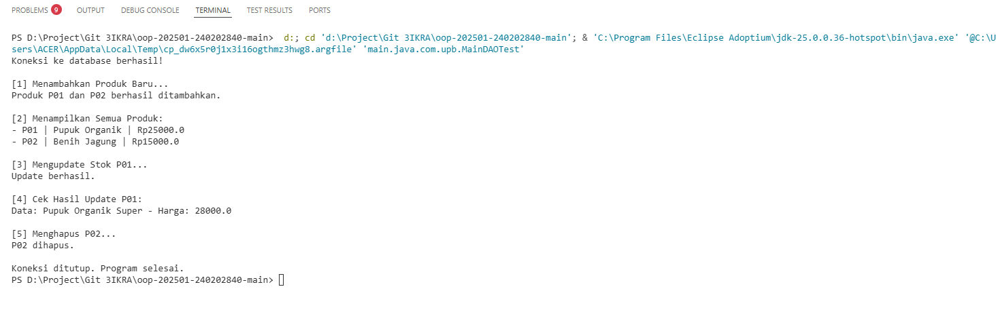

# Laporan Praktikum Minggu 11
Topik: Data Access Object (DAO) dan CRUD Database dengan JDBC

## Identitas
- Nama  : [Muhammad Nuur Fathan]
- NIM   : [240202840]
- Kelas : [3IKRA]

---

## Tujuan
1. Memahami konsep *Data Access Object* (DAO) untuk memisahkan logika bisnis dan akses data.
2. Mampu mengonfigurasi koneksi JDBC (*Java Database Connectivity*) dengan PostgreSQL.
3. Dapat mengimplementasikan operasi CRUD (*Create, Read, Update, Delete*) pada tabel database menggunakan Java.
4. Mengintegrasikan DAO pattern ke dalam aplikasi utama untuk pengelolaan data produk.

---

## Dasar Teori
1. Memahami konsep *Data Access Object* (DAO) untuk memisahkan logika bisnis dan akses data.
2. Mampu mengonfigurasi koneksi JDBC (*Java Database Connectivity*) dengan PostgreSQL.
3. Dapat mengimplementasikan operasi CRUD (*Create, Read, Update, Delete*) pada tabel database menggunakan Java.
4. Mengintegrasikan DAO pattern ke dalam aplikasi utama untuk pengelolaan data produk.

---

## Langkah Praktikum
1. **Persiapan Database:** Membuat database `agripos` dan tabel `products` di PostgreSQL menggunakan pgAdmin.
2. **Setup Project:** Menyiapkan struktur folder project (`com.upb.agripos`) dan menambahkan library **PostgreSQL JDBC Driver** ke dalam *classpath* project.
3. **Membuat Model:** Membuat class `Product.java` dengan atribut `code`, `name`, `price` (double), dan `stock` (int).
4. **Implementasi DAO:** Membuat interface `ProductDAO` dan implementasinya `ProductDAOImpl` yang berisi query SQL menggunakan `PreparedStatement`.
5. **Testing:** Membuat class `MainDAOTest` untuk menguji koneksi dan menjalankan skenario CRUD.
6. **Troubleshooting:** Memperbaiki error pada tipe data angka (int vs double) dan struktur package.

---

## Kode Program  

ProductDAO.Java

```java
package main.java.com.upb.agripos.dao;

import java.util.List;
import main.java.com.upb.agripos.model.Product;

public interface ProductDAO {
    void insert(Product product) throws Exception;
    Product findByCode(String code) throws Exception;
    List<Product> findAll() throws Exception;
    void update(Product product) throws Exception;
    void delete(String code) throws Exception;
}
```

ProductDAOImpl.Java

```java
package main.java.com.upb.agripos.dao;

import java.sql.*;
import java.util.ArrayList;
import java.util.List;
import main.java.com.upb.agripos.model.Product;

public class ProductDAOImpl implements ProductDAO {

    private final Connection connection;

    public ProductDAOImpl(Connection connection) {
        this.connection = connection;
    }

    @Override
    public void insert(Product p) throws Exception {
        String sql = "INSERT INTO products(code, name, price, stock) VALUES (?, ?, ?, ?)";
        try (PreparedStatement ps = connection.prepareStatement(sql)) {
            ps.setString(1, p.getCode());
            ps.setString(2, p.getName());
            ps.setDouble(3, p.getPrice());
            ps.setInt(4, p.getStock());
            ps.executeUpdate();
        }
    }

    @Override
    public Product findByCode(String code) throws Exception {
        String sql = "SELECT * FROM products WHERE code = ?";
        try (PreparedStatement ps = connection.prepareStatement(sql)) {
            ps.setString(1, code);
            try (ResultSet rs = ps.executeQuery()) {
                if (rs.next()) {
                    return new Product(
                        rs.getString("code"),
                        rs.getString("name"),
                        rs.getDouble("price"),
                        rs.getInt("stock")
                    );
                }
            }
        }
        return null;
    }

    @Override
    public List<Product> findAll() throws Exception {
        List<Product> list = new ArrayList<>();
        String sql = "SELECT * FROM products";
        try (PreparedStatement ps = connection.prepareStatement(sql);
             ResultSet rs = ps.executeQuery()) {
            while (rs.next()) {
                list.add(new Product(
                    rs.getString("code"),
                    rs.getString("name"),
                    rs.getDouble("price"),
                    rs.getInt("stock")
                ));
            }
        }
        return list;
    }

    @Override
    public void update(Product p) throws Exception {
        String sql = "UPDATE products SET name=?, price=?, stock=? WHERE code=?";
        try (PreparedStatement ps = connection.prepareStatement(sql)) {
            ps.setString(1, p.getName());
            ps.setDouble(2, p.getPrice());
            ps.setInt(3, p.getStock());
            ps.setString(4, p.getCode());
            ps.executeUpdate();
        }
    }

    @Override
    public void delete(String code) throws Exception {
        String sql = "DELETE FROM products WHERE code=?";
        try (PreparedStatement ps = connection.prepareStatement(sql)) {
            ps.setString(1, code);
            ps.executeUpdate();
        }
    }
}

```

Product.Java

```java
package main.java.com.upb;

import java.sql.Connection;
import java.sql.DriverManager;
import java.util.List;

import main.java.com.upb.agripos.dao.ProductDAO;
import main.java.com.upb.agripos.dao.ProductDAOImpl;
import main.java.com.upb.agripos.model.Product;

public class MainDAOTest {
    public static void main(String[] args) {
        // Ganti parameter DB_URL, USER, PASS sesuai setting lokalmu
        String DB_URL = "jdbc:postgresql://localhost:5432/agripos";
        String USER = "postgres"; 
        String PASS = "admin123"; 

        try {
            // 1. Buat Koneksi
            Connection conn = DriverManager.getConnection(DB_URL, USER, PASS);
            System.out.println("Koneksi ke database berhasil!");

            // 2. Inisialisasi DAO
            ProductDAO dao = new ProductDAOImpl(conn);

            // --- TEST INSERT ---
            System.out.println("\n[1] Menambahkan Produk Baru...");
            Product p1 = new Product("P01", "Pupuk Organik", 25000.0, 50);
            Product p2 = new Product("P02", "Benih Jagung", 15000.0, 100);
            dao.insert(p1);
            dao.insert(p2);
            System.out.println("Produk P01 dan P02 berhasil ditambahkan.");

            // --- TEST READ (Find All) ---
            System.out.println("\n[2] Menampilkan Semua Produk:");
            List<Product> allProducts = dao.findAll();
            for (Product p : allProducts) {
                System.out.println("- " + p.getCode() + " | " + p.getName() + " | Rp" + p.getPrice());
            }

            // --- TEST UPDATE ---
            System.out.println("\n[3] Mengupdate Stok P01...");
            Product pUpdate = dao.findByCode("P01");
            if(pUpdate != null) {
                pUpdate.setName("Pupuk Organik Super");
                pUpdate.setPrice(28000);
                dao.update(pUpdate);
                System.out.println("Update berhasil.");
            }

            // --- TEST READ (Find One) ---
            System.out.println("\n[4] Cek Hasil Update P01:");
            Product pCheck = dao.findByCode("P01");
            if(pCheck != null){
                System.out.println("Data: " + pCheck.getName() + " - Harga: " + pCheck.getPrice());
            }

            // --- TEST DELETE ---
            System.out.println("\n[5] Menghapus P02...");
            dao.delete("P02");
            System.out.println("P02 dihapus.");

            // Tutup koneksi
            conn.close();
            System.out.println("\nKoneksi ditutup. Program selesai.");

        } catch (Exception e) {
            e.printStackTrace();
        }
    }
}
```

MainDAOTest.Java

```java
package main.java.com.upb;

import java.sql.Connection;
import java.sql.DriverManager;
import java.util.List;

import main.java.com.upb.agripos.dao.ProductDAO;
import main.java.com.upb.agripos.dao.ProductDAOImpl;
import main.java.com.upb.agripos.model.Product;

public class MainDAOTest {
    public static void main(String[] args) {
        // Ganti parameter DB_URL, USER, PASS sesuai setting lokalmu
        String DB_URL = "jdbc:postgresql://localhost:5432/agripos";
        String USER = "postgres"; 
        String PASS = "admin123"; 

        try {
            // 1. Buat Koneksi
            Connection conn = DriverManager.getConnection(DB_URL, USER, PASS);
            System.out.println("Koneksi ke database berhasil!");

            // 2. Inisialisasi DAO
            ProductDAO dao = new ProductDAOImpl(conn);

            // --- TEST INSERT ---
            System.out.println("\n[1] Menambahkan Produk Baru...");
            Product p1 = new Product("P01", "Pupuk Organik", 25000.0, 50);
            Product p2 = new Product("P02", "Benih Jagung", 15000.0, 100);
            dao.insert(p1);
            dao.insert(p2);
            System.out.println("Produk P01 dan P02 berhasil ditambahkan.");

            // --- TEST READ (Find All) ---
            System.out.println("\n[2] Menampilkan Semua Produk:");
            List<Product> allProducts = dao.findAll();
            for (Product p : allProducts) {
                System.out.println("- " + p.getCode() + " | " + p.getName() + " | Rp" + p.getPrice());
            }

            // --- TEST UPDATE ---
            System.out.println("\n[3] Mengupdate Stok P01...");
            Product pUpdate = dao.findByCode("P01");
            if(pUpdate != null) {
                pUpdate.setName("Pupuk Organik Super");
                pUpdate.setPrice(28000);
                dao.update(pUpdate);
                System.out.println("Update berhasil.");
            }

            // --- TEST READ (Find One) ---
            System.out.println("\n[4] Cek Hasil Update P01:");
            Product pCheck = dao.findByCode("P01");
            if(pCheck != null){
                System.out.println("Data: " + pCheck.getName() + " - Harga: " + pCheck.getPrice());
            }

            // --- TEST DELETE ---
            System.out.println("\n[5] Menghapus P02...");
            dao.delete("P02");
            System.out.println("P02 dihapus.");

            // Tutup koneksi
            conn.close();
            System.out.println("\nKoneksi ditutup. Program selesai.");

        } catch (Exception e) {
            e.printStackTrace();
        }
    }
}
```

---

## Hasil Eksekusi



---

## Analisis
1. **Alur Program:** Program dimulai dengan membuka koneksi ke database PostgreSQL `agripos` menggunakan `DriverManager`. Objek `ProductDAOImpl` kemudian diinisialisasi dengan koneksi tersebut. Operasi CRUD dilakukan dengan memanggil method pada DAO, yang secara internal menerjemahkan objek Java menjadi query SQL (`INSERT`, `SELECT`, `UPDATE`, `DELETE`).
2. **Perbedaan Pendekatan:** Berbeda dengan praktikum sebelumnya yang menyimpan data sementara di memori (`ArrayList`), praktikum ini menyimpan data secara persisten di database. Data tidak hilang meskipun program dihentikan.
3. **Kendala & Solusi:**
* **Tipe Data:** Awalnya terjadi error `constructor is undefined` karena input harga di Main berupa `int` (25000), sedangkan konstruktor `Product` meminta `double`. Solusinya adalah mengubah input menjadi `25000.0` dan memastikan atribut di class Model bertipe `double`.
* **Package Naming:** Terjadi error path karena struktur folder `src/main/java...` terbaca sebagai nama package. Solusinya adalah menyesuaikan deklarasi `package` di setiap file agar sesuai dengan struktur folder fisik project.
* **Koneksi:** Penyesuaian password database menjadi `admin123` diperlukan agar otentikasi JDBC berhasil.

---

## Kesimpulan
Penerapan pola desain DAO (Data Access Object) membuat kode aplikasi menjadi lebih terstruktur dan *maintainable*. Logika bisnis terpisah dari logika akses data, sehingga perubahan pada database tidak merusak kode utama. Penggunaan JDBC memungkinkan aplikasi Java untuk melakukan manipulasi data secara *real-time* ke database PostgreSQL. Melalui praktikum ini, dipahami pentingnya kesesuaian tipe data antara Java dan Database serta konfigurasi *driver* yang tepat.

---

## Quiz
1. **Apa kegunaan dari interface dalam pola desain DAO?**
**Jawaban:** Interface digunakan sebagai kontrak yang mendefinisikan operasi apa saja (CRUD) yang harus tersedia, sehingga implementasi di baliknya (misal ganti database dari PostgreSQL ke MySQL) bisa diubah tanpa mengganggu kode utama yang memanggilnya.
2. **Mengapa kita menggunakan `PreparedStatement` daripada `Statement` biasa?**
**Jawaban:** `PreparedStatement` lebih aman karena mencegah serangan *SQL Injection* dengan memisahkan query SQL dari data (parameter). Selain itu, performanya lebih cepat untuk query yang dijalankan berulang-ulang karena sudah dikompilasi sebelumnya (*pre-compiled*).
3. **Apa fungsi dari `ResultSet`?**
**Jawaban:** `ResultSet` berfungsi untuk menampung hasil data yang dikembalikan dari eksekusi query `SELECT`. Kita menggunakan kursor pada `ResultSet` (method `next()`) untuk mengambil baris data satu per satu.
