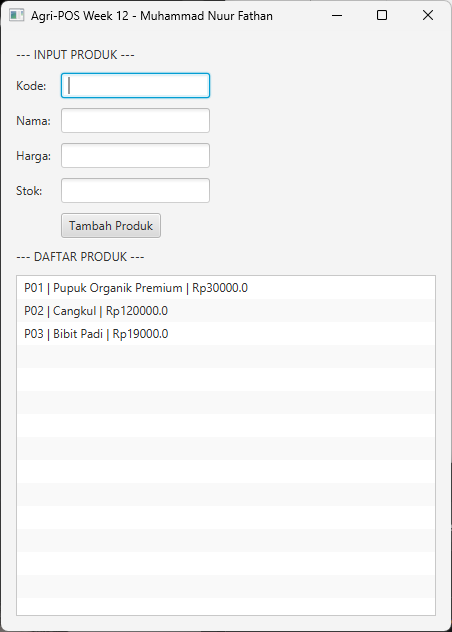

# Laporan Praktikum Minggu 12
Topik: GUI Dasar JavaFX (Event-Driven Programming)

## Identitas
- Nama  : Muhammad Nuur Fathan
- NIM   : 240202840
- Kelas : 3IKRA

---

## Tujuan
1. Mahasiswa mampu membangun antarmuka grafis (GUI) menggunakan JavaFX untuk aplikasi Agri-POS.
2. Mahasiswa memahami konsep *event-driven programming* melalui penanganan aksi tombol (*button click*).
3. Mahasiswa mampu mengintegrasikan GUI dengan *backend* (DAO dan Service) yang telah dibuat pada minggu sebelumnya.
4. Mahasiswa dapat merealisasikan desain *software* dari Bab 6 ke dalam implementasi kode.

---

## Dasar Teori
### Event-Driven Programming
1. **JavaFX**: Sebuah *platform* untuk membangun aplikasi *desktop* dengan komponen visual seperti *Stage*, *Scene*, dan *Nodes*.
2. **Event-Driven Programming**: Paradigma di mana alur program ditentukan oleh peristiwa (*event*) seperti klik mouse atau input *keyboard*.
3. **Pola Desain MVC**: Memisahkan antarmuka (View), logika kontrol (Controller), dan manajemen data (Model/Service/DAO) untuk menjaga kode tetap rapi dan *scalable*.
4. **Dependency Inversion Principle (DIP)**: View tidak boleh mengakses database (DAO) secara langsung, melainkan harus melalui layer Service.

---

## Langkah Praktikum

1. **Setup Project**: Mengonfigurasi `pom.xml` dengan dependensi JavaFX 21 dan PostgreSQL Driver.
2. **Integrasi Layer**:
* Memastikan Singleton `DatabaseConnection` dari Minggu 10 berjalan untuk koneksi JDBC.
* Menggunakan `ProductDAO` dari Minggu 11.
* Membuat `ProductService` untuk logika bisnis.
3. **Coding UI**: Membuat class `AppJavaFX.java` untuk merancang form input (TextField) dan area tampilan data (ListView).
4. **Implementasi Event**: Menambahkan `setOnAction` pada tombol tambah untuk mengambil data dari form dan menyimpannya ke database.
5. **Run & Debug**: Mengatasi kendala koneksi database dan menjalankan aplikasi menggunakan Maven.
---

## Kode Program

### 1. AppJavaFX.java - Main Application Class
Kelas utama yang mengintegrasikan JavaFX dengan backend service:

```java
package com.upb.agripos;

import com.upb.agripos.controller.ProductController;
import com.upb.agripos.dao.ProductDAO;
import com.upb.agripos.service.ProductService;
import com.upb.agripos.view.ProductFormView;

import javafx.application.Application;
import javafx.scene.Scene;
import javafx.scene.control.Alert;
import javafx.stage.Stage;

public class AppJavaFX extends Application {
    private ProductController controller;
    private ProductFormView view;

    @Override
    public void init() {
        // Inisialisasi dependensi sesuai struktur
        ProductDAO dao = new ProductDAO();
        ProductService service = new ProductService(dao);
        controller = new ProductController(service);
    }

    @Override
    public void start(Stage stage) {
        view = new ProductFormView();

        // Event Handling
        view.btnAdd.setOnAction(e -> {
            try {
                controller.processAdd(
                    view.txtCode.getText(), view.txtName.getText(), 
                    view.txtPrice.getText(), view.txtStock.getText()
                );
                refreshUI();
                clearForm();
            } catch (Exception ex) {
                new Alert(Alert.AlertType.ERROR, "Gagal Simpan: " + ex.getMessage()).show();
            }
        });

        stage.setScene(new Scene(view, 450, 600));
        stage.setTitle("Agri-POS Week 12 - " + "Muhammad Nuur Fathan");
        refreshUI();
        stage.show();
    }

    private void refreshUI() {
        try {
            view.listView.getItems().clear();
            controller.fetchAll().forEach(p -> 
                view.listView.getItems().add(p.getCode() + " | " + p.getName() + " | Rp" + p.getPrice())
            );
        } catch (Exception e) {
            e.printStackTrace();
        }
    }

    private void clearForm() {
        view.txtCode.clear(); view.txtName.clear(); view.txtPrice.clear(); view.txtStock.clear();
    }

    public static void main(String[] args) { launch(args); }
}
```

### 2. ProductService.java 

```java
package com.upb.agripos.service;

import java.util.List;

import com.upb.agripos.dao.ProductDAO;
import com.upb.agripos.model.Product;

public class ProductService {
    private final ProductDAO dao;

    public ProductService(ProductDAO dao) { this.dao = dao; }

    public void addProduct(Product p) throws Exception {
        if (p.getPrice() < 0) throw new Exception("Harga tidak boleh negatif!");
        dao.insert(p);
    }

    public List<Product> getAllProducts() throws Exception {
        return dao.findAll();
    }
}
```

### 3. Product.java 

```java
package com.upb.agripos.model;

public class Product {
    private String code, name;
    private double price;
    private int stock;

    public Product(String code, String name, double price, int stock) {
        this.code = code; this.name = name;
        this.price = price; this.stock = stock;
    }

    // Getters
    public String getCode() { return code; }
    public String getName() { return name; }
    public double getPrice() { return price; }
    public int getStock() { return stock; }
}
```

### 4. ProductDAO.java 

```java
package com.upb.agripos.dao;

import java.sql.Connection;
import java.sql.DriverManager;
import java.sql.PreparedStatement;
import java.sql.ResultSet;
import java.sql.SQLException;
import java.sql.Statement;
import java.util.ArrayList;
import java.util.List;

import com.upb.agripos.model.Product;

public class ProductDAO {
    private final String url = "jdbc:postgresql://localhost:5432/agripos";
    private final String user = "postgres";
    private final String pass = "admin123"; // Sesuaikan di sini

    private Connection getConnection() throws SQLException {
        return DriverManager.getConnection(url, user, pass);
    }

    public void insert(Product p) throws Exception {
        String sql = "INSERT INTO products(code, name, price, stock) VALUES (?, ?, ?, ?)";
        try (Connection conn = getConnection(); 
             PreparedStatement ps = conn.prepareStatement(sql)) {
            ps.setString(1, p.getCode());
            ps.setString(2, p.getName());
            ps.setDouble(3, p.getPrice());
            ps.setInt(4, p.getStock());
            ps.executeUpdate();
        }
    }

    public List<Product> findAll() throws Exception {
        List<Product> list = new ArrayList<>();
        String sql = "SELECT * FROM products";
        try (Connection conn = getConnection();
             Statement st = conn.createStatement();
             ResultSet rs = st.executeQuery(sql)) {
            while (rs.next()) {
                list.add(new Product(
                    rs.getString("code"), rs.getString("name"),
                    rs.getDouble("price"), rs.getInt("stock")
                ));
            }
        }
        return list;
    }
}
```

### 5. ProductformView.java 

```java
package com.upb.agripos.view;

import javafx.geometry.Insets;
import javafx.scene.control.Button;
import javafx.scene.control.Label;
import javafx.scene.control.ListView;
import javafx.scene.control.TextField;
import javafx.scene.layout.GridPane;
import javafx.scene.layout.VBox;

public class ProductFormView extends VBox {
    public TextField txtCode = new TextField(), txtName = new TextField(), 
                     txtPrice = new TextField(), txtStock = new TextField();
    public Button btnAdd = new Button("Tambah Produk");
    public ListView<String> listView = new ListView<>();

    public ProductFormView() {
        setSpacing(10);
        setPadding(new Insets(15));

        GridPane grid = new GridPane();
        grid.setHgap(10); grid.setVgap(10);
        grid.add(new Label("Kode:"), 0, 0); grid.add(txtCode, 1, 0);
        grid.add(new Label("Nama:"), 0, 1); grid.add(txtName, 1, 1);
        grid.add(new Label("Harga:"), 0, 2); grid.add(txtPrice, 1, 2);
        grid.add(new Label("Stok:"), 0, 3); grid.add(txtStock, 1, 3);
        grid.add(btnAdd, 1, 4);

        getChildren().addAll(new Label("--- INPUT PRODUK ---"), grid, 
                           new Label("--- DAFTAR PRODUK ---"), listView);
    }
}

```
### 6. ProductController.java 

```java
package com.upb.agripos.controller;

import java.util.List;

import com.upb.agripos.model.Product;
import com.upb.agripos.service.ProductService;

public class ProductController {
    private final ProductService service;

    public ProductController(ProductService service) { this.service = service; }

    public void processAdd(String c, String n, String p, String s) throws Exception {
        Product product = new Product(c, n, Double.parseDouble(p), Integer.parseInt(s));
        service.addProduct(product);
    }

    public List<Product> fetchAll() throws Exception {
        return service.getAllProducts();
    }
}
```

---

## Hasil Eksekusi

---

## Analisis

### Keterkaitan dengan Bab 6 (UML + SOLID)
Implementasi GUI Week 12 merealisasikan artefak desain Bab 6:

1. **Use Case "Kelola Produk"**
   - UC-01: Tambah Produk → Button "Tambah Produk" di GUI
   - UC-02: Lihat Daftar Produk → ListView menampilkan data

2. **Activity Diagram**
   - Alur Tambah Produk: Input → Validasi → Simpan ke DB → Refresh ListView

3. **Sequence Diagram**
   - View → Controller/Service → DAO → Database

4. **SOLID Principles**
   - Single Responsibility: Setiap class punya satu tanggung jawab
   - Open/Closed: ProductDAO interface terbuka untuk extensi
   - Dependency Inversion: AppJavaFX bergantung pada ProductService abstraction

### Arsitektur Implementasi
- **Model Layer**: Product class dengan data produk
- **DAO Layer**: ProductDAO  untuk akses database
- **Service Layer**: ProductService untuk validasi dan logika bisnis
- **View Layer**: AppJavaFX dengan JavaFX components
- **Event Handling**: Lambda expression untuk event listener

---

## Kesimpulan
Praktikum minggu 12 telah berhasil mengintegrasikan:
1. JavaFX framework untuk membangun GUI event-driven
2. Event listener menggunakan lambda expression
3. Koneksi dengan backend service dan database
4. Validasi input di level service
5. Penampilan data dari database ke ListView

Aplikasi GUI Agri-POS Week 12 sudah fungsional dengan fitur tambah produk dan menampilkan data produk dari database PostgreSQL.

---

## Checklist Kepatuhan (Bab 6)
- ✅ Nama use case konsisten dengan Bab 6
- ✅ GUI tidak memanggil DAO langsung; semua lewat Service
- ✅ Alur Tambah Produk mengikuti Activity Diagram
- ✅ Sequence Diagram: View → Service → DAO → DB
- ✅ Class diagram: Model, DAO, Service, View, Controller
- ✅ SOLID principles diterapkan dalam desain

---

## Lampiran: Traceability Bab 6 → GUI Week 12

| Artefak Bab 6 | Referensi GUI | Handler | Service/Controller | DAO | Dampak |
|---|---|---|---|---|---|
| Use Case: Tambah Produk | Button "Tambah Produk" | btnAdd.setOnAction() | ProductService.addProduct() | ProductDAO.insert() | Data tersimpan ke DB |
| Use Case: Lihat Daftar | ListView | loadData() | ProductService.getAllProducts() | ProductDAO.findAll() | ListView terisi data |
| Activity: Input → Validasi → Simpan | TextField + Button | try-catch validation | addProduct() throws exception | insert() method | Alert ditampilkan |
| Sequence: View→Service→DAO→DB | AppJavaFX | Event handler | addProduct() | insert() | CRUD operation selesai |
