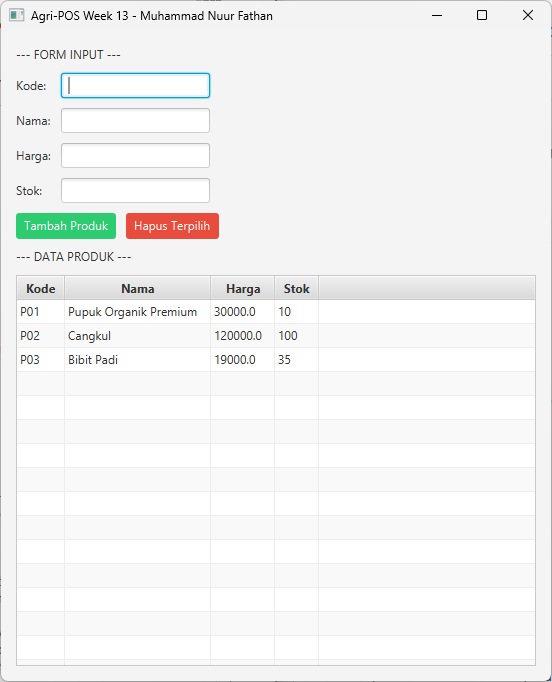

# Laporan Praktikum Minggu 1 (sesuaikan minggu ke berapa?)
Topik: [Tuliskan judul topik, misalnya "Class dan Object"]

## Identitas
- Nama  : [Nama Mahasiswa]
- NIM   : [NIM Mahasiswa]
- Kelas : [Kelas]

---

## Tujuan
1. Mahasiswa mampu menampilkan data menggunakan `TableView` JavaFX untuk menyajikan informasi produk secara terstruktur.
2. Mahasiswa mampu mengintegrasikan koleksi objek (`ObservableList`) dengan antarmuka grafis.
3. Mahasiswa mampu menggunakan **Lambda Expression** untuk menyederhanakan penulisan *event handling* pada tombol.
4. Mahasiswa mampu menghubungkan GUI dengan layer DAO secara penuh, mencakup fungsi tambah dan hapus data.

---

## Dasar Teori
**TableView JavaFX**: Komponen antarmuka yang memungkinkan data ditampilkan dalam kolom dan baris, mempermudah pembacaan atribut objek seperti Kode, Nama, dan Harga secara sejajar.
2. **Lambda Expression**: Sintaksis ringkas di Java untuk mendefinisikan *anonymous function*, sering digunakan dalam JavaFX untuk menggantikan *inner class* pada *event handler* tombol.
3. **Property Value Factory**: Fitur yang menghubungkan atribut pada class Model dengan kolom tabel secara otomatis melalui refleksi.
4. **Pola Desain MVC & DIP**: Struktur aplikasi memisahkan View dari DAO melalui layer Service, memastikan logika bisnis tetap terisolasi dari perubahan tampilan.

---

## Langkah Praktikum
1. **Update DAO & Service**: Menambahkan fungsionalitas `delete` pada `ProductDAO` dan `ProductService` untuk menghapus data di database PostgreSQL.
2. **Setup View Lanjutan**: Membuat class `ProductTableView` yang mengonfigurasi `TableColumn` dan menginisialisasi `PropertyValueFactory` untuk setiap kolom.
3. **Implementasi Lambda**: Menuliskan logika aksi pada tombol `btnAdd` dan `btnDelete` menggunakan ekspresi lambda `(e -> { ... })` di dalam `AppJavaFX`.
4. **Validasi & Integrasi**: Memastikan setiap aksi di GUI memicu pembaruan otomatis (*reload*) pada `TableView` agar data selaras dengan database.

---

## Kode Program
 
### ProductController.java

```java
package com.upb.agripos.controller;

import java.util.List;

import com.upb.agripos.model.Product;
import com.upb.agripos.service.ProductService;

public class ProductController {
    private final ProductService service;
    public ProductController(ProductService service) { this.service = service; }

    public void processAdd(String c, String n, String p, String s) throws Exception {
        service.addProduct(new Product(c, n, Double.parseDouble(p), Integer.parseInt(s)));
    }

    public List<Product> fetchAll() throws Exception { return service.getAllProducts(); }

    public void processDelete(String code) throws Exception { service.removeProduct(code); }
}
```
### ProductDAO.java

```java
package com.upb.agripos.dao;

import java.sql.Connection;
import java.sql.DriverManager;
import java.sql.PreparedStatement;
import java.sql.ResultSet;
import java.sql.SQLException;
import java.sql.Statement;
import java.util.ArrayList;
import java.util.List;

import com.upb.agripos.model.Product;

public class ProductDAO {
    private final String url = "jdbc:postgresql://localhost:5432/agripos";
    private final String user = "postgres";
    private final String pass = "admin123"; // Sesuaikan password PostgreSQL kamu

    private Connection getConnection() throws SQLException {
        return DriverManager.getConnection(url, user, pass);
    }

    public void insert(Product p) throws Exception {
        String sql = "INSERT INTO products(code, name, price, stock) VALUES (?, ?, ?, ?)";
        try (Connection conn = getConnection(); PreparedStatement ps = conn.prepareStatement(sql)) {
            ps.setString(1, p.getCode()); ps.setString(2, p.getName());
            ps.setDouble(3, p.getPrice()); ps.setInt(4, p.getStock());
            ps.executeUpdate();
        }
    }

    public List<Product> findAll() throws Exception {
        List<Product> list = new ArrayList<>();
        String sql = "SELECT * FROM products";
        try (Connection conn = getConnection(); Statement st = conn.createStatement(); ResultSet rs = st.executeQuery(sql)) {
            while (rs.next()) {
                list.add(new Product(rs.getString("code"), rs.getString("name"), rs.getDouble("price"), rs.getInt("stock")));
            }
        }
        return list;
    }

    public void delete(String code) throws Exception {
        String sql = "DELETE FROM products WHERE code = ?";
        try (Connection conn = getConnection(); PreparedStatement ps = conn.prepareStatement(sql)) {
            ps.setString(1, code);
            ps.executeUpdate();
        }
    }
}
```
### Product.java

```java
package com.upb.agripos.model;

public class Product {
    private String code, name;
    private double price;
    private int stock;

    public Product(String code, String name, double price, int stock) {
        this.code = code; this.name = name;
        this.price = price; this.stock = stock;
    }

    public String getCode() { return code; }
    public String getName() { return name; }
    public double getPrice() { return price; }
    public int getStock() { return stock; }
}
```

### ProductService.java

```java
package com.upb.agripos.service;

import java.util.List;

import com.upb.agripos.dao.ProductDAO;
import com.upb.agripos.model.Product;

public class ProductService {
    private final ProductDAO dao;
    public ProductService(ProductDAO dao) { this.dao = dao; }

    public void addProduct(Product p) throws Exception {
        if (p.getPrice() < 0) throw new Exception("Harga tidak boleh negatif!");
        dao.insert(p);
    }

    public List<Product> getAllProducts() throws Exception { return dao.findAll(); }

    public void removeProduct(String code) throws Exception { dao.delete(code); }
}
```

### ProductTableView.java

```java
package com.upb.agripos.view;

import com.upb.agripos.model.Product;

import javafx.geometry.Insets;
import javafx.scene.control.Button;
import javafx.scene.control.Label;
import javafx.scene.control.TableColumn;
import javafx.scene.control.TableView;
import javafx.scene.control.TextField;
import javafx.scene.control.cell.PropertyValueFactory;
import javafx.scene.layout.GridPane;
import javafx.scene.layout.HBox;
import javafx.scene.layout.VBox;

public class ProductTableView extends VBox {
    public TextField txtCode = new TextField(), txtName = new TextField(), 
                     txtPrice = new TextField(), txtStock = new TextField();
    public Button btnAdd = new Button("Tambah Produk"), btnDelete = new Button("Hapus Terpilih");
    public TableView<Product> table = new TableView<>();

    public ProductTableView() {
        setSpacing(10); setPadding(new Insets(15));

        // Konfigurasi Kolom Tabel
        TableColumn<Product, String> colCode = new TableColumn<>("Kode");
        colCode.setCellValueFactory(new PropertyValueFactory<>("code"));
        TableColumn<Product, String> colName = new TableColumn<>("Nama");
        colName.setCellValueFactory(new PropertyValueFactory<>("name"));
        TableColumn<Product, Double> colPrice = new TableColumn<>("Harga");
        colPrice.setCellValueFactory(new PropertyValueFactory<>("price"));
        TableColumn<Product, Integer> colStock = new TableColumn<>("Stok");
        colStock.setCellValueFactory(new PropertyValueFactory<>("stock"));

        table.getColumns().addAll(colCode, colName, colPrice, colStock);

        GridPane grid = new GridPane();
        grid.setHgap(10); grid.setVgap(10);
        grid.add(new Label("Kode:"), 0, 0); grid.add(txtCode, 1, 0);
        grid.add(new Label("Nama:"), 0, 1); grid.add(txtName, 1, 1);
        grid.add(new Label("Harga:"), 0, 2); grid.add(txtPrice, 1, 2);
        grid.add(new Label("Stok:"), 0, 3); grid.add(txtStock, 1, 3);

        HBox actions = new HBox(10, btnAdd, btnDelete);
        btnDelete.setStyle("-fx-background-color: #e74c3c; -fx-text-fill: white;");
        btnAdd.setStyle("-fx-background-color: #2ecc71; -fx-text-fill: white;");

        getChildren().addAll(new Label("--- FORM INPUT ---"), grid, actions, 
                           new Label("--- DATA PRODUK ---"), table);
    }
}
```
### AppJavaFX.java
```java
package com.upb.agripos;

import com.upb.agripos.controller.ProductController;
import com.upb.agripos.dao.ProductDAO;
import com.upb.agripos.model.Product;
import com.upb.agripos.service.ProductService;
import com.upb.agripos.view.ProductTableView;

import javafx.application.Application;
import javafx.scene.Scene;
import javafx.scene.control.Alert;
import javafx.stage.Stage;

public class AppJavaFX extends Application {
    private ProductController controller;
    private ProductTableView view;

    @Override
    public void init() {
        controller = new ProductController(new ProductService(new ProductDAO()));
    }

    @Override
    public void start(Stage stage) {
        view = new ProductTableView();

        // Lambda: Handle Tambah
        view.btnAdd.setOnAction(e -> {
            try {
                controller.processAdd(view.txtCode.getText(), view.txtName.getText(), 
                                     view.txtPrice.getText(), view.txtStock.getText());
                refreshTable(); clearForm();
            } catch (Exception ex) { showMsg("Error", ex.getMessage(), Alert.AlertType.ERROR); }
        });

        // Lambda: Handle Hapus
        view.btnDelete.setOnAction(e -> {
            Product selected = view.table.getSelectionModel().getSelectedItem();
            if (selected != null) {
                try {
                    controller.processDelete(selected.getCode());
                    refreshTable();
                } catch (Exception ex) { showMsg("Error", ex.getMessage(), Alert.AlertType.ERROR); }
            } else { showMsg("Peringatan", "Pilih data di tabel dulu!", Alert.AlertType.WARNING); }
        });

        stage.setScene(new Scene(view, 550, 650));
        stage.setTitle("Agri-POS Week 13 - Muhammad Nuur Fathan");
        refreshTable(); stage.show();
    }

    private void refreshTable() {
        try { view.table.getItems().setAll(controller.fetchAll()); } catch (Exception e) { e.printStackTrace(); }
    }

    private void clearForm() { view.txtCode.clear(); view.txtName.clear(); view.txtPrice.clear(); view.txtStock.clear(); }

    private void showMsg(String t, String c, Alert.AlertType type) {
        Alert a = new Alert(type); a.setTitle(t); a.setContentText(c); a.show();
    }

    public static void main(String[] args) { launch(args); }
}
```
---

## Hasil Eksekusi


---

## Analisis
* **Alur Kerja**: Aplikasi berjalan dengan menginisialisasi `ProductController` yang memuat data dari `ProductDAO`. Penggunaan `PropertyValueFactory` memungkinkan `TableView` secara otomatis menarik data dari objek `Product` selama nama atributnya cocok.
* **Perbedaan Pendekatan**: Penggunaan `TableView` (Week 13) jauh lebih terorganisir dibanding `ListView` (Week 12) karena menyajikan data per atribut dalam kolom terpisah. Selain itu, **Lambda Expression** membuat penulisan *event handler* jauh lebih ringkas dan efisien secara baris kode.
* **Kendala & Solusi**: Kendala utama adalah sinkronisasi tampilan tabel setelah data dihapus di database. Solusinya adalah memanggil method `refreshTable()` yang menjalankan `setAll()` pada item tabel segera setelah aksi hapus di database berhasil dieksekusi.

---


## Traceability
| Artefak Bab 6 | Referensi | Handler GUI | Controller/Service | DAO | Dampak UI/DB |
| --- | --- | --- | --- | --- | --- |
| **Use Case** | UC-02 Lihat Daftar Produk | `init()` / `refreshTable()` | `controller.fetchAll()` | `ProductDAO.findAll()` | TableView terisi data DB |
| **Use Case** | UC-03 Hapus Produk | `btnDelete.setOnAction` | `controller.processDelete()` | `ProductDAO.delete()` | DB delete + Tabel reload |
| **Sequence** | SD-02 Hapus Produk | Lambda Handler | View  Controller  Service | DAO  Database | Urutan panggil sesuai desain |

## Kesimpulan
Praktikum Minggu 13 berhasil meningkatkan kapabilitas antarmuka Agri-POS. Dengan integrasi `TableView` dan `Lambda Expression`, aplikasi menjadi lebih interaktif dan profesional. Pemisahan layer yang konsisten memastikan fitur hapus dapat diimplementasikan dengan dampak minimal pada komponen kode lainnya.
---