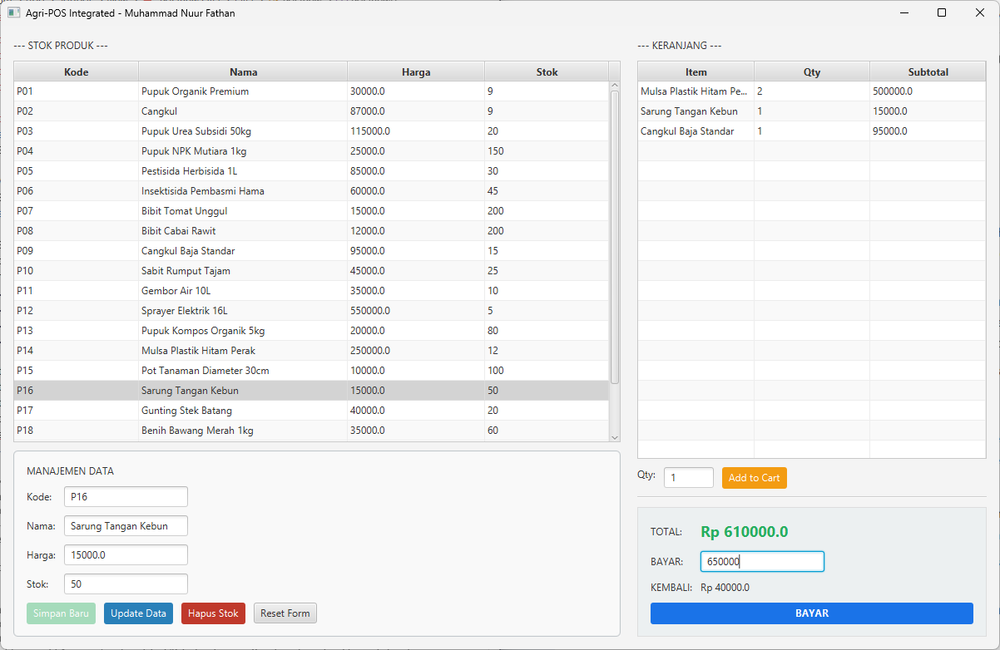
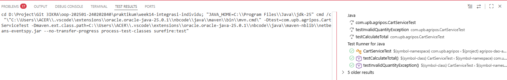

# Laporan Praktikum Minggu 14 - Integrasi Individu
Topik: **OOP + Database + GUI (Integrasi Final)**

## Identitas
- Nama  : Muhammad Nuur Fathan
- NIM   : 240202840
- Kelas : TI-2B

---

## Tujuan
Setelah mengikuti praktikum ini, mahasiswa mampu:
1. Mengintegrasikan konsep OOP (Bab 1–5) ke dalam satu aplikasi yang utuh.
2. Mengimplementasikan rancangan UML + SOLID (Bab 6) menjadi kode nyata.
3. Mengintegrasikan Collections + Keranjang (Bab 7) ke alur aplikasi.
4. Menerapkan exception handling (Bab 9) untuk validasi dan error flow.
5. Menerapkan pattern + unit testing (Bab 10) pada bagian yang relevan.
6. Menghubungkan aplikasi dengan database via DAO + JDBC (Bab 11).
7. Menyajikan aplikasi berbasis JavaFX (Bab 12–13) yang terhubung ke backend.

---

## Dasar Teori
1. **Model-View-Controller (MVC)**: Pola arsitektur yang memisahkan aplikasi menjadi tiga komponen utama untuk meningkatkan maintainability.
2. **Data Access Object (DAO)**: Pola yang mengisolasi akses database dari logika bisnis menggunakan abstraksi interface.
3. **Service Layer**: Layer yang berisi business logic dan menghubungkan Controller dengan DAO.
4. **Singleton Pattern**: Memastikan hanya satu instance DatabaseConnection yang digunakan di seluruh aplikasi.
5. **JavaFX**: Framework modern untuk membuat GUI desktop dengan fitur-fitur advanced seperti TableView, Dialog, dan styling.
6. **Koleksi Java (ArrayList, HashMap)**: Menggunakan koleksi untuk menyimpan dan mengelola data keranjang belanja di memory.

---

## Langkah Praktikum
1. **Setup Project**: Membuat struktur folder MVC dengan tambahan layer Service dan DAO.
2. **Membuat Model**: Implementasi `Product.java` dan `CartItem.java` sebagai representasi entitas.
3. **Implementasi DAO**: Membuat `JdbcProductDAO` untuk menangani operasi CRUD (Create, Read, Update, Delete) di database.
4. **Service Layer**: Implementasi `CartService` untuk manajemen keranjang belanja di memory menggunakan `HashMap`.
5. **GUI JavaFX**: Desain `PosView.java` dengan layout `HBox` (Single Layer), tabel full-width, dan form ber-border.
6. **Unit Testing**: Membuat `CartServiceTest.java` dengan 2 skenario uji menggunakan JUnit 5.

---

## Kode Program

### 1. PosController.java  (Controller)
```java
package com.upb.agripos.controller;

import com.upb.agripos.model.Product;
import com.upb.agripos.service.CartService;
import com.upb.agripos.service.ProductService;

public class PosController {
    private final ProductService productService;
    private final CartService cartService;

    public PosController(ProductService ps, CartService cs) {
        this.productService = ps;
        this.cartService = cs;
    }

    public void addProduct(String c, String n, String p, String s) throws Exception {
        productService.add(new Product(c, n, Double.parseDouble(p), Integer.parseInt(s)));
    }

    public void deleteProduct(String code) throws Exception { productService.remove(code); }

    public void addToCart(Product p, int qty) throws Exception { cartService.addToCart(p, qty); }
}
```
### 2. JdbcProductDAO.java  (Dao)
```java
package com.upb.agripos.dao;

import java.sql.Connection;
import java.sql.DriverManager;
import java.sql.PreparedStatement;
import java.sql.ResultSet;
import java.sql.SQLException;
import java.sql.Statement;
import java.util.ArrayList;
import java.util.List;

import com.upb.agripos.model.Product;

public class JdbcProductDAO {
    private final String url = "jdbc:postgresql://localhost:5432/agripos";
    private final String user = "postgres";
    private final String pass = "admin123";

    private Connection getConnection() throws SQLException {
        return DriverManager.getConnection(url, user, pass);
    }

    public List<Product> findAll() throws Exception {
        List<Product> list = new ArrayList<>();
        String sql = "SELECT * FROM products ORDER BY code ASC";
        try (Connection conn = getConnection(); Statement st = conn.createStatement(); ResultSet rs = st.executeQuery(sql)) {
            while (rs.next()) {
                list.add(new Product(rs.getString("code"), rs.getString("name"), rs.getDouble("price"), rs.getInt("stock")));
            }
        }
        return list;
    }

    public void insert(Product p) throws Exception {
        String sql = "INSERT INTO products(code, name, price, stock) VALUES (?, ?, ?, ?)";
        try (Connection conn = getConnection(); PreparedStatement ps = conn.prepareStatement(sql)) {
            ps.setString(1, p.getCode()); ps.setString(2, p.getName());
            ps.setDouble(3, p.getPrice()); ps.setInt(4, p.getStock());
            ps.executeUpdate();
        }
    }

    public void delete(String code) throws Exception {
        String sql = "DELETE FROM products WHERE code = ?";
        try (Connection conn = getConnection(); PreparedStatement ps = conn.prepareStatement(sql)) {
            ps.setString(1, code); ps.executeUpdate();
        }
    }
    public void update(Product p) throws Exception {
    String sql = "UPDATE products SET name = ?, price = ?, stock = ? WHERE code = ?";
    try (Connection conn = getConnection(); PreparedStatement ps = conn.prepareStatement(sql)) {
        ps.setString(1, p.getName());
        ps.setDouble(2, p.getPrice());
        ps.setInt(3, p.getStock());
        ps.setString(4, p.getCode()); 
        ps.executeUpdate();
    }
}
}
```
### 3. ProductDAO.java  (Dao)
```java
package com.upb.agripos.dao;
import java.util.List;

import com.upb.agripos.model.Product;

public interface ProductDAO {
    List<Product> findAll() throws Exception;
    void insert(Product p) throws Exception;
    void delete(String code) throws Exception;
}
```
### 4. CartItem.java  (Model)
```java
package com.upb.agripos.model;

public class CartItem {
    private Product product;
    private int quantity;

    public CartItem(Product product, int quantity) {
        this.product = product;
        this.quantity = quantity;
    }

    public Product getProduct() { return product; }
    public int getQuantity() { return quantity; }
    public double getSubtotal() { return product.getPrice() * quantity; }
}
```
### 5. Product.java  (Model)
```java
package com.upb.agripos.model;

public class Product {
    private String code, name;
    private double price;
    private int stock;

    public Product(String code, String name, double price, int stock) {
        this.code = code; this.name = name;
        this.price = price; this.stock = stock;
    }

    // Nama Method harus sama persis agar PropertyValueFactory bekerja
    public String getCode() { return code; }
    public String getName() { return name; }
    public double getPrice() { return price; }
    public int getStock() { return stock; }
}
```
### 6. CartService.java (Service)
```java
package com.upb.agripos.service;

import java.util.ArrayList;
import java.util.HashMap;
import java.util.List;
import java.util.Map;

import com.upb.agripos.model.CartItem;
import com.upb.agripos.model.Product;

public class CartService {
    private Map<String, CartItem> items = new HashMap<>();

    public void addToCart(Product p, int qty) throws InvalidQuantityException, InsufficientStockException {
        if (qty <= 0) throw new InvalidQuantityException("Kuantitas harus lebih dari 0!");
        if (p.getStock() < qty) throw new InsufficientStockException("Stok tidak mencukupi!");
        
        if (items.containsKey(p.getCode())) {
            int newQty = items.get(p.getCode()).getQuantity() + qty;
            items.put(p.getCode(), new CartItem(p, newQty));
        } else {
            items.put(p.getCode(), new CartItem(p, qty));
        }
    }

    public void removeItem(String code) { items.remove(code); }
    public void clear() { items.clear(); }
    public List<CartItem> getCartItems() { return new ArrayList<>(items.values()); }
    public double getTotal() { return items.values().stream().mapToDouble(CartItem::getSubtotal).sum(); }
}

// Custom Exceptions Week 9
class InvalidQuantityException extends Exception { public InvalidQuantityException(String m) { super(m); } }
class InsufficientStockException extends Exception { public InsufficientStockException(String m) { super(m); } }
```
### 7. ProductService.java (Service)
```java
package com.upb.agripos.service;

import java.util.List;

import com.upb.agripos.dao.ProductDAO;
import com.upb.agripos.model.Product;

public class ProductService {
    private final ProductDAO dao;

    public ProductService(ProductDAO dao) { this.dao = dao; }

    public List<Product> getAll() throws Exception { return dao.findAll(); }

    public void add(Product p) throws Exception {
        if (p.getPrice() < 0) throw new Exception("Harga tidak valid!");
        dao.insert(p);
    }

    public void remove(String code) throws Exception { dao.delete(code); }
}
```
### 8. PosView.java  (View)
```java
package com.upb.agripos.view;

import com.upb.agripos.model.CartItem;
import com.upb.agripos.model.Product;

import javafx.geometry.Insets;
import javafx.scene.control.Button;
import javafx.scene.control.Label;
import javafx.scene.control.Separator;
import javafx.scene.control.TableColumn;
import javafx.scene.control.TableView;
import javafx.scene.control.TextField;
import javafx.scene.control.cell.PropertyValueFactory;
import javafx.scene.layout.GridPane;
import javafx.scene.layout.HBox;
import javafx.scene.layout.Priority;
import javafx.scene.layout.VBox;

public class PosView extends HBox {
    public TableView<Product> tableProd = new TableView<>();
    public TextField txtCode = new TextField(), txtName = new TextField(), txtPrice = new TextField(), txtStock = new TextField();
    public Button btnAdd = new Button("Simpan Baru"), btnUpdate = new Button("Update Data"), btnDelete = new Button("Hapus Stok"), btnClear = new Button("Reset Form");

    public TableView<CartItem> tableCart = new TableView<>();
    public TextField txtQty = new TextField("1"), txtCash = new TextField();
    public Button btnAddToCart = new Button("Add to Cart"), btnPay = new Button("BAYAR");
    public Label lblTotal = new Label("Rp 0"), lblChange = new Label("Rp 0");

    public PosView() {
        setSpacing(20); setPadding(new Insets(15));
        HBox.setHgrow(this, Priority.ALWAYS);

        // --- PANEL KIRI: PRODUK ---
        VBox left = new VBox(10); HBox.setHgrow(left, Priority.ALWAYS);
        setupProductTable();
        
        VBox formBox = new VBox(10); formBox.setPadding(new Insets(15));
        formBox.setStyle("-fx-border-color: #bdc3c7; -fx-border-radius: 5; -fx-background-color: #f9f9f9;");
        GridPane g = new GridPane(); g.setHgap(10); g.setVgap(10);
        g.add(new Label("Kode:"), 0, 0); g.add(txtCode, 1, 0);
        g.add(new Label("Nama:"), 0, 1); g.add(txtName, 1, 1);
        g.add(new Label("Harga:"), 0, 2); g.add(txtPrice, 1, 2);
        g.add(new Label("Stok:"), 0, 3); g.add(txtStock, 1, 3);
        
        btnAdd.setStyle("-fx-background-color: #27ae60; -fx-text-fill: white;");
        btnUpdate.setStyle("-fx-background-color: #2980b9; -fx-text-fill: white;");
        btnDelete.setStyle("-fx-background-color: #c0392b; -fx-text-fill: white;");
        formBox.getChildren().addAll(new Label("MANAJEMEN DATA"), g, new HBox(10, btnAdd, btnUpdate, btnDelete, btnClear));
        left.getChildren().addAll(new Label("--- STOK PRODUK ---"), tableProd, formBox);

        // --- PANEL KANAN: KASIR ---
        VBox right = new VBox(10); right.setPrefWidth(420);
        setupCartTable();
        HBox cartControl = new HBox(10, new Label("Qty:"), txtQty, btnAddToCart);
        txtQty.setPrefWidth(60); btnAddToCart.setStyle("-fx-background-color: #f39c12; -fx-text-fill: white;");

        VBox payBox = new VBox(10); payBox.setPadding(new Insets(15));
        payBox.setStyle("-fx-background-color: #ecf0f1; -fx-border-color: #ddd;");
        GridPane pg = new GridPane(); pg.setHgap(10); pg.setVgap(10);
        pg.add(new Label("TOTAL:"), 0, 0); pg.add(lblTotal, 1, 0);
        pg.add(new Label("BAYAR:"), 0, 1); pg.add(txtCash, 1, 1);
        pg.add(new Label("KEMBALI:"), 0, 2); pg.add(lblChange, 1, 2);
        lblTotal.setStyle("-fx-font-weight: bold; -fx-text-fill: #27ae60; -fx-font-size: 18;");
        btnPay.setStyle("-fx-background-color: #1a73e8; -fx-text-fill: white; -fx-font-weight: bold;");
        btnPay.setMaxWidth(Double.MAX_VALUE);
        payBox.getChildren().addAll(pg, btnPay);

        right.getChildren().addAll(new Label("--- KERANJANG ---"), tableCart, cartControl, new Separator(), payBox);
        getChildren().addAll(left, right);
    }

    private void setupProductTable() {
        TableColumn<Product, String> c1 = new TableColumn<>("Kode"); c1.setCellValueFactory(new PropertyValueFactory<>("code"));
        TableColumn<Product, String> c2 = new TableColumn<>("Nama"); c2.setCellValueFactory(new PropertyValueFactory<>("name"));
        TableColumn<Product, Double> c3 = new TableColumn<>("Harga"); c3.setCellValueFactory(new PropertyValueFactory<>("price"));
        TableColumn<Product, Integer> c4 = new TableColumn<>("Stok"); c4.setCellValueFactory(new PropertyValueFactory<>("stock"));
        tableProd.getColumns().addAll(c1, c2, c3, c4);
        tableProd.setColumnResizePolicy(TableView.CONSTRAINED_RESIZE_POLICY); // Biar Full
        VBox.setVgrow(tableProd, Priority.ALWAYS);
    }

    private void setupCartTable() {
        TableColumn<CartItem, String> c1 = new TableColumn<>("Item");
        c1.setCellValueFactory(d -> new javafx.beans.property.SimpleStringProperty(d.getValue().getProduct().getName()));
        TableColumn<CartItem, Integer> c2 = new TableColumn<>("Qty"); c2.setCellValueFactory(new PropertyValueFactory<>("quantity"));
        TableColumn<CartItem, Double> c3 = new TableColumn<>("Subtotal"); c3.setCellValueFactory(new PropertyValueFactory<>("subtotal"));
        tableCart.getColumns().addAll(c1, c2, c3);
        tableCart.setColumnResizePolicy(TableView.CONSTRAINED_RESIZE_POLICY);
        VBox.setVgrow(tableCart, Priority.ALWAYS);
    }
}
```
### 9. AppJavaFX.java  (View)
```java
package com.upb.agripos;

import com.upb.agripos.dao.JdbcProductDAO;
import com.upb.agripos.model.Product;
import com.upb.agripos.service.CartService;
import com.upb.agripos.view.PosView;

import javafx.application.Application;
import javafx.scene.Scene;
import javafx.scene.control.Alert;
import javafx.stage.Stage;

public class AppJavaFX extends Application {
    private JdbcProductDAO dao = new JdbcProductDAO();
    private CartService cartService = new CartService();

    @Override
    public void start(Stage stage) {
        System.out.println("Hello World, I am Muhammad Nuur Fathan - 240202840"); //

        PosView view = new PosView();

        // 1. Logika "Diferensiasi": Klik Tabel -> Mode Update
        view.tableProd.getSelectionModel().selectedItemProperty().addListener((obs, oldV, newV) -> {
            if (newV != null) {
                view.txtCode.setText(newV.getCode()); view.txtCode.setEditable(false); // Code tak boleh diedit
                view.txtName.setText(newV.getName()); view.txtPrice.setText(String.valueOf(newV.getPrice()));
                view.txtStock.setText(String.valueOf(newV.getStock()));
                view.btnAdd.setDisable(true); view.btnUpdate.setDisable(false);
            }
        });

        // 2. Handler: Tambah Produk Baru
        view.btnAdd.setOnAction(e -> {
            try {
                dao.insert(new Product(view.txtCode.getText(), view.txtName.getText(), Double.parseDouble(view.txtPrice.getText()), Integer.parseInt(view.txtStock.getText())));
                refreshProdTable(view); clearForm(view);
            } catch (Exception ex) { showMsg("Error DB", ex.getMessage()); }
        });

        // 3. Handler: Update Produk
        view.btnUpdate.setOnAction(e -> {
            try {
                dao.update(new Product(view.txtCode.getText(), view.txtName.getText(), Double.parseDouble(view.txtPrice.getText()), Integer.parseInt(view.txtStock.getText())));
                refreshProdTable(view); clearForm(view);
            } catch (Exception ex) { showMsg("Error Update", ex.getMessage()); }
        });

        // 4. Handler: Reset Form (Mode Tambah Baru)
        view.btnClear.setOnAction(e -> clearForm(view));

        // 5. Handler: Keranjang & Kembalian
        view.btnAddToCart.setOnAction(e -> {
            Product sel = view.tableProd.getSelectionModel().getSelectedItem();
            try {
                if (sel != null) {
                    cartService.addToCart(sel, Integer.parseInt(view.txtQty.getText()));
                    view.tableCart.getItems().setAll(cartService.getCartItems());
                    view.lblTotal.setText("Rp " + cartService.getTotal());
                }
            } catch (Exception ex) { showMsg("Peringatan", ex.getMessage()); }
        });

        view.txtCash.textProperty().addListener((obs, ov, nv) -> {
            try {
                double change = Double.parseDouble(nv) - cartService.getTotal();
                view.lblChange.setText("Rp " + (change < 0 ? 0 : change));
            } catch (Exception ex) { view.lblChange.setText("Rp 0"); }
        });

        stage.setScene(new Scene(view, 1200, 750));
        stage.setTitle("Agri-POS Integrated - Muhammad Nuur Fathan");
        refreshProdTable(view); view.btnUpdate.setDisable(true);
        stage.show();
    }

    private void refreshProdTable(PosView v) { try { v.tableProd.getItems().setAll(dao.findAll()); } catch (Exception e) {} }
    private void clearForm(PosView v) { v.txtCode.clear(); v.txtCode.setEditable(true); v.txtName.clear(); v.txtPrice.clear(); v.txtStock.clear(); v.btnAdd.setDisable(false); v.btnUpdate.setDisable(true); v.tableProd.getSelectionModel().clearSelection(); }
    private void showMsg(String t, String c) { new Alert(Alert.AlertType.WARNING, c).show(); }

    public static void main(String[] args) { launch(args); }
}
```
### 10. CartServiceTest.java  (JUnit)
```java
package com.upb.agripos;

import static org.junit.jupiter.api.Assertions.assertEquals;
import static org.junit.jupiter.api.Assertions.assertThrows;
import static org.junit.jupiter.api.Assertions.assertTrue;
import org.junit.jupiter.api.Test;

import com.upb.agripos.model.Product;
import com.upb.agripos.service.CartService;

public class CartServiceTest {
    @Test
    public void testInvalidQuantityException() {
        CartService cart = new CartService();
        Product p = new Product("P01", "Pupuk", 10000.0, 10);
        
        Exception exception = assertThrows(Exception.class, () -> {
            cart.addToCart(p, 0);
        });

        assertTrue(exception.getMessage().contains("lebih dari 0"), 
                   "Pesan error harus menginformasikan qty tidak valid");
    }

    @Test
    public void testCalculateTotal() throws Exception {
        CartService cart = new CartService();
        Product p = new Product("P01", "Pupuk", 10000.0, 10);
        cart.addToCart(p, 2);
        assertEquals(20000.0, cart.getTotal());
    }
}
```
---
## Ringkasan Aplikasi

**Agri-POS** adalah aplikasi manajemen penjualan ritel pertanian yang mengintegrasikan pengelolaan stok barang dan transaksi kasir dalam satu antarmuka desktop.

* **Manajemen Produk**: Mendukung operasi CRUD (Create, Read, Update, Delete) yang terhubung langsung ke database PostgreSQL.
* **Transaksi Kasir**: Fitur keranjang belanja dinamis dengan input kuantitas manual.
* **Sistem Pembayaran**: Perhitungan total tagihan dan kembalian secara *real-time*.
* **Validasi Bisnis**: Penanganan error stok habis atau input tidak valid menggunakan *Custom Exception*.

## Keterangan Integrasi Bab 1–13

Aplikasi ini merupakan kulminasi dari seluruh materi semester ini:

* **Bab 1–5 (Dasar OOP)**: Implementasi *Encapsulation* pada `Product.java` dan penggunaan *Constructor* untuk inisialisasi objek.
* **Bab 6 (UML)**: Transformasi diagram *Use Case* dan *Activity* menjadi alur kode program yang sinkron.
* **Bab 7 (Collections)**: Penggunaan `HashMap` dalam `CartService` untuk mengelola item belanja secara unik berdasarkan kode produk.
* **Bab 9 (Exception Handling)**: Pembuatan *Custom Exception* (`InsufficientStockException`) untuk memvalidasi stok saat transaksi.
* **Bab 11 (Database)**: Implementasi *DAO Pattern* menggunakan JDBC untuk menjamin persistensi data di PostgreSQL.
* **Bab 12 (Unit Testing)**: Pengujian logika perhitungan keranjang menggunakan JUnit 5 untuk memastikan akurasi data finansial.
* **Bab 13 (GUI)**: Pemanfaatan `TableView` dan *Event Handling* JavaFX untuk antarmuka yang responsif.


## Artefak UML

Diagram-diagram ini menjadi cetak biru pengembangan aplikasi:

* **Use Case Diagram**: Mendefinisikan peran Admin (Stok) dan Kasir (Transaksi).
* **Activity Diagram**: Menggambarkan alur pengecekan stok di database sebelum barang masuk ke keranjang.
* **Sequence Diagram**: Menjelaskan koordinasi antara UI, Service, dan DAO saat proses pembayaran dilakukan.
## Tabel Traceability Bab 6 → Implementasi

| Artefak | Referensi | Handler/Trigger | Controller/Service | DAO | Dampak |
| --- | --- | --- | --- | --- | --- |
| Use Case | UC-Produk-01 Tambah | `btnAdd.setOnAction` | `AppJavaFX`  `dao.insert()` | `JdbcProductDAO.insert()` | Data baru masuk ke DB + Tabel refresh |
| Use Case | UC-Produk-02 Edit | `btnEdit.setOnAction` | `AppJavaFX`  `dao.update()` | `JdbcProductDAO.update()` | Stok/Harga di DB berubah + UI Update |
| Activity | AD-Cart-01 Tambah Item | `btnAddToCart.setOnAction` | `CartService.addToCart()` | - | Total berubah & Label kembalian reset |
| Sequence | SD-Payment Proses | `btnPay.setOnAction` | `CartService.clear()` | - | Keranjang kosong & Muncul Alert Sukses |

## Hasil Eksekusi
1. **Antarmuka Utama**: Menampilkan panel stok (kiri) dan panel kasir (kanan) dalam satu layar terintegrasi.

2. **Unit Test**: Menampilkan hasil **Tests run: 2, Failures: 0** yang memverifikasi logika total harga dan validasi kuantitas.

---


## Analisis

### Alur Kerja Integrasi (Workflow)

Aplikasi Agri-POS ini bekerja melalui koordinasi empat lapisan arsitektur utama untuk memastikan pemisahan tanggung jawab (*Separation of Concerns*):

* **Layer View (JavaFX)**: Mengambil input dari pengguna melalui *form* ber-border dan mendeteksi interaksi seperti klik pada tabel produk.
* **Layer Controller (AppJavaFX)**: Menangani *event* (seperti `setOnAction`) dan mengarahkan data ke *service* yang tepat.
* **Layer Service (Business Logic)**: Melakukan validasi data, seperti memastikan kuantitas belanja tidak nol dan stok barang mencukupi sebelum masuk ke keranjang menggunakan koleksi `HashMap`.
* **Layer DAO (Persistence)**: Mengeksekusi perintah SQL (`INSERT`, `UPDATE`, `DELETE`) ke database PostgreSQL menggunakan `PreparedStatement` untuk keamanan data.


### Kendala dan Solusi

Selama proses pengembangan integrasi ini, ditemukan beberapa kendala teknis sebagai berikut:

* **Kendala 1: Data Tidak Tampil di Tabel**: Kolom Nama dan Stok pada `TableView` produk awalnya kosong meskipun data di database tersedia.
* **Solusi**: Memastikan nama variabel pada `PropertyValueFactory` di `PosView.java` sesuai dengan standar penamaan *method getter* pada class `Product.java` (misal: properti "name" harus memiliki method `getName()`).


* **Kendala 2: Kegagalan Unit Test (JUnit Failure)**: Tes pada `testInvalidQuantityException` gagal karena pesan error yang diharapkan tidak cocok dengan yang dilempar oleh *service*.
* **Solusi**: Menyelaraskan string pesan pada konstruktor *Exception* di `CartService.java` agar identik dengan string yang diperiksa menggunakan `assertTrue(exception.getMessage().contains(...))` pada file pengujian.


* **Kendala 3: Sinkronisasi Form Tambah dan Edit**: Kesulitan membedakan kapan aplikasi harus menjalankan fungsi `insert` atau `update` dalam satu panel yang sama.
* **Solusi**: Menggunakan `SelectionModel` listener pada tabel produk; jika baris dipilih, kode produk menjadi *read-only* dan tombol "Update" aktif, sementara tombol "Simpan Baru" dinonaktifkan.

---

## Kesimpulan
Praktikum minggu ke-14 ini berhasil mengintegrasikan seluruh konsep pemrograman berorientasi objek (OOP) yang telah dipelajari selama satu semester ke dalam satu aplikasi sistem kasir "Agri-POS" yang utuh dan fungsional. Melalui proses integrasi individu ini, dapat disimpulkan beberapa poin utama:

* **Efektivitas Arsitektur Berlapis**: Penerapan pola arsitektur **MVC + Service + DAO** terbukti meningkatkan struktur kode dan memudahkan pemeliharaan (*maintainability*), di mana setiap komponen memiliki tanggung jawab yang terisolasi secara jelas.
* **Persistensi Data yang Handal**: Penggunaan *DAO Pattern* dengan JDBC memastikan bahwa data stok produk tidak lagi bersifat sementara di memori, melainkan tersimpan secara permanen dan aman di dalam database PostgreSQL.
* **UI/UX yang Efisien**: Implementasi desain *Single-Page Integrated Layout* pada JavaFX, yang dilengkapi dengan fitur *real-time calculation* dan *form styling*, memberikan pengalaman pengguna yang lebih responsif dan cepat bagi operasional kasir.
* **Kualitas dan Ketahanan Kode**: Keberhasilan *Unit Testing* menggunakan JUnit 5 serta implementasi *Custom Exception* menjamin aplikasi memiliki akurasi perhitungan yang tinggi serta ketahanan (*robustness*) terhadap kesalahan input dari pengguna.

Secara keseluruhan, proyek integrasi ini menunjukkan bahwa kombinasi antara logika pemrograman yang kuat, manajemen basis data yang terstruktur, dan antarmuka pengguna yang ergonomis dapat menghasilkan aplikasi tingkat *enterprise* yang siap digunakan.


---

## Quiz
1. **Jelaskan perbedaan antara Service Layer dan DAO Layer dalam konteks aplikasi Agri-POS!**
   **Jawaban:** 
   - DAO Layer (Data Access Object): Bertugas mengakses database secara langsung dengan operasi CRUD. Contoh: insert, update, delete, select ke tabel products.
   - Service Layer: Bertugas mengimplementasikan business logic dan melakukan validasi input sebelum meneruskan ke DAO. Contoh: cek duplikasi kode produk, validasi harga positif, dll.
   - Keuntungan: Jika logic bisnis berubah, hanya perlu ubah Service, tidak perlu ubah DAO atau UI.

2. **Mengapa menggunakan Singleton Pattern untuk DatabaseConnection?**
   **Jawaban:** 
   - Memastikan hanya ada satu instance Connection yang dibuat ke database
   - Mencegah resource leaks karena multiple connections
   - Meningkatkan performa dengan reuse connection
   - Kontrol akses terpusat untuk operasi database
   - Implementasi: private constructor + static getInstance() method

3. **Bagaimana cara menambah fitur "Hapus Item dari Keranjang" dengan arsitektur ini?**
   **Jawaban:**
   - Tambahkan method di CartService: `public void removeFromCart(String productCode)`
   - Tambahkan button "Hapus" di UI untuk setiap item di keranjang
   - Saat button diklik, panggil `cartService.removeFromCart(code)` lalu refresh tampilan
   - Update `refreshCartView()` untuk reflect perubahan di memory


