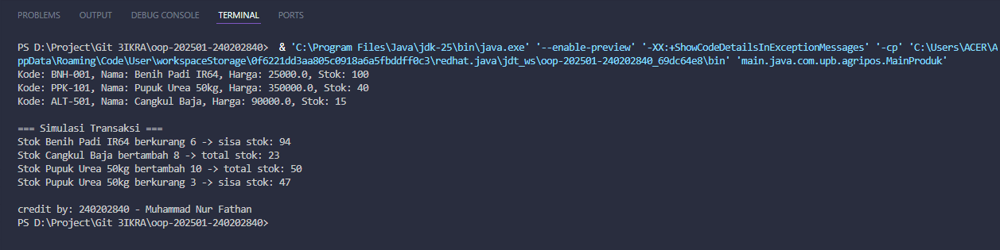

# **Laporan Praktikum Minggu 2**

**Topik:** *Class dan Object (Produk Pertanian)*

---

## **Identitas**

* **Nama:** Muhammad Nur Fathan
* **NIM:** 240202840
* **Kelas:** 3IKRA

---

## **Tujuan**

- Mahasiswa mampu **menjelaskan konsep class, object, atribut, dan method** dalam OOP.  
- Mahasiswa mampu **menerapkan access modifier dan enkapsulasi** dalam pembuatan class.  
- Mahasiswa mampu **mengimplementasikan class Produk pertanian** dengan atribut dan method yang sesuai.  
- Mahasiswa mampu **mendemonstrasikan instansiasi object** serta menampilkan data produk pertanian di console.  
- Mahasiswa mampu **menyusun laporan praktikum** dengan bukti kode, hasil eksekusi, dan analisis sederhana.  
---

## **Dasar Teori**

1. **Class** adalah blueprint atau rancangan yang digunakan untuk membuat objek. Setiap class mendefinisikan atribut (data) dan method (perilaku).
2. **Object** merupakan instance nyata dari sebuah class yang bisa digunakan untuk melakukan aksi dan menyimpan data.
3. **Enkapsulasi** adalah mekanisme untuk melindungi atribut dari akses langsung dengan menggunakan *getter* dan *setter*.
4. **Package** dalam Java berfungsi untuk mengelompokkan class agar proyek menjadi terorganisir dan mudah dikelola.
5. **Static method** dapat dipanggil tanpa membuat objek, cocok digunakan untuk fungsi umum seperti penandaan kredit atau utilitas.

---

## **Langkah Praktikum**

1. Membuat struktur folder sesuai standar Java:

   ```
   oop-20251-<nim>/
 └─ praktikum/week2-class-object/
     ├─ src/main/java/com/upb/agripos/model/
     │   └─ Produk.java
     ├─ src/main/java/com/upb/agripos/util/
     │   └─ CreditBy.java
     ├─ src/main/java/com/upb/agripos/
     │   └─ MainProduk.java
     ├─ screenshots/
     │   └─ hasil.png
     └─ laporan_week2.md
   ```
2. Mengimplementasikan class `Produk` dengan atribut `kode`, `nama`, `harga`, dan `stok`, serta beberapa method pengelolaan stok.
3. Membuat class `CreditBy` yang berfungsi mencetak identitas pembuat program.
4. Membuat class `MainProduk` sebagai titik eksekusi program yang menampilkan data produk dan simulasi transaksi stok.
5. Melakukan *testing* dan commit dengan pesan:

   > “Menambahkan class Produk, CreditBy, dan MainProduk untuk simulasi transaksi produk pertanian.”

---

## **Kode Program 1 – Produk.java**

```java
package main.java.com.upb.agripos.model;

public class Produk {
    private String kode;
    private String nama;
    private double harga;
    private int stok;

    public Produk(String kode, String nama, double harga, int stok) {
        this.kode = kode;
        this.nama = nama;
        this.harga = harga;
        this.stok = stok;
    }

    public String getKode() { return kode; }
    public void setKode(String kode) { this.kode = kode; }

    public String getNama() { return nama; }
    public void setNama(String nama) { this.nama = nama; }

    public double getHarga() { return harga; }
    public void setHarga(double harga) { this.harga = harga; }

    public int getStok() { return stok; }
    public void setStok(int stok) { this.stok = stok; }

    public void tambahStok(int jumlah) {
        this.stok += jumlah;
        System.out.println("Stok " + nama + " bertambah " + jumlah + " -> total stok: " + stok);
    }

    public void kurangiStok(int jumlah) {
        if (this.stok >= jumlah) {
            this.stok -= jumlah;
            System.out.println("Stok " + nama + " berkurang " + jumlah + " -> sisa stok: " + stok);
        } else {
            System.out.println("Stok tidak mencukupi untuk " + nama + "!");
        }
    }

    public void tampilkanInfo() {
        System.out.println("Kode: " + kode + ", Nama: " + nama + ", Harga: " + harga + ", Stok: " + stok);
    }

    public double hitungTotal(int jumlah) {
        return harga * jumlah;
    }
}
```

---

## **Kode Program 2 – CreditBy.java**

```java
package main.java.com.upb.agripos.util;

public class CreditBy {
    public static void print(String nim, String nama) {
        System.out.println("\ncredit by: " + nim + " - " + nama);
    }
}
```

---

## **Kode Program 3 – MainProduk.java**

```java
package main.java.com.upb.agripos;

import main.java.com.upb.agripos.model.Produk;
import main.java.com.upb.agripos.util.CreditBy;

public class MainProduk {
    public static void main(String[] args) {
        Produk p1 = new Produk("BNH-001", "Benih Padi IR64", 25000, 100);
        Produk p2 = new Produk("PPK-101", "Pupuk Urea 50kg", 350000, 40);
        Produk p3 = new Produk("ALT-501", "Cangkul Baja", 90000, 15);

        // tampilkan semua info produk 
        p1.tampilkanInfo();
        p2.tampilkanInfo();
        p3.tampilkanInfo();

        // Simulasi transaksi stok
        System.out.println("\n=== Simulasi Transaksi ===");
        p1.kurangiStok(6);
        p3.tambahStok(8);
        p2.tambahStok(10);
        p2.kurangiStok(3);

        // tampilkan credit 
        CreditBy.print("240202840", "Muhammad Nur Fathan");
    }
}
```

---

## **Hasil Eksekusi**

```

```

---

## **Analisis**

* Program menunjukkan penerapan prinsip **enkapsulasi**, di mana atribut tidak diakses langsung melainkan melalui *getter* dan *setter*.
* Method `tambahStok()` dan `kurangiStok()` merepresentasikan aktivitas nyata di dunia pertanian seperti penambahan dan pengurangan stok.
* Struktur **package** (`model`, `util`, `main`) memperlihatkan bagaimana OOP membantu mengorganisir kode agar lebih mudah dikelola.
* `CreditBy` menggunakan konsep **static method**, yang efisien karena tidak memerlukan objek tambahan untuk sekadar menampilkan informasi pembuat.
* Program berjalan lancar tanpa error, menandakan hubungan antar-class dan antar-package sudah benar.

---

## **Kesimpulan**

Melalui praktikum ini, mahasiswa dapat memahami bagaimana konsep *class* dan *object* diimplementasikan dalam Java secara modular.
Pemisahan tanggung jawab setiap class membuat kode lebih bersih, mudah dibaca, dan sesuai dengan prinsip dasar OOP.
Dengan pendekatan ini, sistem seperti AgriPOS dapat dikembangkan lebih lanjut dengan menambah fitur tanpa mengubah struktur utama.

---

## **Quiz**

1. **Jelaskan fungsi dan manfaat class `CreditBy` dalam proyek AgriPOS ini!**
   **Jawaban:**
   Class `CreditBy` berfungsi sebagai *utility class* yang menampilkan identitas pembuat program. Dengan menggunakan method static `print()`, kita tidak perlu membuat objek baru untuk menjalankan fungsinya. Ini memperlihatkan efisiensi dan pemisahan tanggung jawab dalam program. Class ini juga membantu menjaga profesionalitas kode dengan mencantumkan kredit pembuat pada output program.

2. **Apa yang akan terjadi jika method `kurangiStok()` dipanggil dengan jumlah lebih besar dari stok yang tersedia? Mengapa validasi tersebut penting?**
   **Jawaban:**
   Jika jumlah pengurangan lebih besar dari stok, maka program akan menampilkan pesan *"Stok tidak mencukupi untuk [nama produk]!"* tanpa mengubah nilai stok. Validasi ini penting agar data tetap konsisten dan logika bisnis tidak rusak (misalnya, stok menjadi negatif). Konsep ini termasuk penerapan kontrol logika dalam OOP untuk menjaga keandalan sistem.

3. **Jelaskan alasan pentingnya membuat struktur package (`model`, `util`, `main`) dalam pengembangan proyek OOP berbasis Java!**
   **Jawaban:**
   Struktur package membantu mengorganisir file berdasarkan fungsinya.

   * Package `model` menyimpan class yang berhubungan dengan data dan logika bisnis (seperti `Produk`).
   * Package `util` berisi class pendukung atau fungsi umum (`CreditBy`).
   * Package utama (`main`) menjadi titik eksekusi program (`MainProduk`).
     Dengan pemisahan ini, kode lebih terstruktur, mudah diperluas, dan dapat digunakan kembali (*reusable*). Hal ini sangat penting dalam proyek besar agar tim pengembang bisa bekerja paralel tanpa konflik.

---


