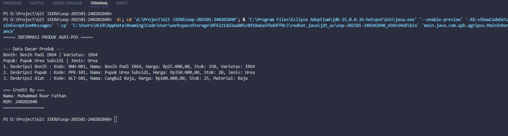

# Laporan Praktikum Minggu 1 (sesuaikan minggu ke berapa?)
Topik: [Tuliskan judul topik, misalnya "Class dan Object"]

## Identitas
- Nama  : Muhammad Nuur Fathan
- NIM   : 240202840
- Kelas : 3IKRA

---

## Tujuan
* Mahasiswa mampu menjelaskan konsep *inheritance (pewarisan class)* dalam OOP.
* Mahasiswa mampu membuat *superclass* dan *subclass* untuk produk pertanian.
* Mahasiswa mampu mendemonstrasikan hierarki class melalui contoh kode.
* Mahasiswa mampu menggunakan `super` untuk memanggil konstruktor dan method parent class.
* Mahasiswa mampu membuat laporan praktikum yang menjelaskan penerapan inheritance dalam program.

---

## Dasar Teori
1. **Inheritance** adalah mekanisme dalam OOP yang memungkinkan suatu class mewarisi atribut dan method dari class lain.
2. **Superclass** adalah class induk yang menyimpan atribut umum agar bisa digunakan kembali oleh subclass.
3. **Subclass** adalah class turunan yang dapat menambahkan atribut dan method spesifik.
4. Kata kunci **`super`** digunakan untuk memanggil konstruktor atau method dari superclass.
5. Konsep inheritance meningkatkan **reusability** dan **keteraturan struktur kode** dalam OOP.


---

## Langkah Praktikum
1. **Membuat Superclass Produk**  
   - Gunakan class `Produk` dari Bab 2 sebagai superclass.  

2. **Membuat Subclass**  
   - `Benih.java` → atribut tambahan: varietas.  
   - `Pupuk.java` → atribut tambahan: jenis pupuk (Urea, NPK, dll).  
   - `AlatPertanian.java` → atribut tambahan: material (baja, kayu, plastik).  

3. **Membuat Main Class**  
   - Instansiasi minimal satu objek dari tiap subclass.  
   - Tampilkan data produk dengan memanfaatkan inheritance.  

4. **Menambahkan CreditBy**  
   - Panggil class `CreditBy` untuk menampilkan identitas mahasiswa.  

5. **Commit dan Push**  
   - Commit dengan pesan: `week3-inheritance`.  

---

## Kode Program
### Produk.java

```java
package main.java.com.upb.agripos.model;
public class Produk {
    private String kode;
    private String nama;
    private double harga;
    private int stok;

    public Produk(String kode, String nama, double harga, int stok) {
        this.kode = kode;
        this.nama = nama;
        this.harga = harga;
        this.stok = stok;
    }

    public String getKode() { return kode; }
    public String getNama() { return nama; }
    public double getHarga() { return harga; }
    public int getStok() { return stok; }

    public void setKode(String kode) { this.kode = kode; }
    public void setNama(String nama) { this.nama = nama; }
    public void setHarga(double harga) { this.harga = harga; }
    public void setStok(int stok) { this.stok = stok; }

    public String deskripsi() {
        return "Kode: " + this.kode +
               ", Nama: " + this.nama +
               ", Harga: Rp" + String.format("%,.2f", this.harga) +
               ", Stok: " + this.stok;
    }
}
```

### Benih.java

```java
package main.java.com.upb.agripos.model;

public class Benih extends Produk {
    private String varietas;

    public Benih(String kode, String nama, double harga, int stok, String varietas) {
        super(kode, nama, harga, stok);
        this.varietas = varietas;
    }

    public String getVarietas() { return varietas; }
    public void setVarietas(String varietas) { this.varietas = varietas; }

    @Override
    public String deskripsi() {
        return super.deskripsi() + ", Varietas: " + this.varietas;
    }
}
```

### Pupuk.java

```java
package main.java.com.upb.agripos.model;

public class Pupuk extends Produk {
    private String jenis;

    public Pupuk(String kode, String nama, double harga, int stok, String jenis) {
        super(kode, nama, harga, stok);
        this.jenis = jenis;
    }

    public String getJenis() { return jenis; }
    public void setJenis(String jenis) { this.jenis = jenis; }

    @Override
    public String deskripsi() {
        return super.deskripsi() + ", Jenis: " + this.jenis;
    }
}
```

### AlatPertanian.java

```java
package main.java.com.upb.agripos.model;

public class AlatPertanian extends Produk {
    private String material;

    public AlatPertanian(String kode, String nama, double harga, int stok, String material) {
        super(kode, nama, harga, stok);
        this.material = material;
    }

    public String getMaterial() { return material; }
    public void setMaterial(String material) { this.material = material; }

    @Override
    public String deskripsi() {
        return super.deskripsi() + ", Material: " + this.material;
    }
}
```

### CreditBy.java

```java
package main.java.com.upb.agripos.util;

public class CreditBy {
    public static void print(String nim, String nama) {
        System.out.println("\n=== Credit By ===");
        System.out.println("Dikembangkan oleh: " + nama);
        System.out.println("NIM: " + nim);
        System.out.println("=================\n");
    }
}
```

### MainInheritance.java

```java
package main.java.com.upb.agripos;

import main.java.com.upb.agripos.model.*;
import main.java.com.upb.agripos.util.CreditBy;

public class MainInheritance {
    public static void main(String[] args) {

        Benih benihPadi = new Benih("BNH-001", "Benih Padi IR64", 25000, 150, "IR64");
        Pupuk pupukUrea = new Pupuk("PPK-101", "Pupuk Urea Subsidi", 350000, 20, "Urea");
        AlatPertanian cangkul = new AlatPertanian("ALT-501", "Cangkul Baja", 100000, 25, "Baja");

        System.out.println("===== INFORMASI PRODUK AGRI-POS =====");
        System.out.println("\n--- Data Dasar Produk ---");
        System.out.println("Benih: " + benihPadi.getNama() + " | Varietas: " + benihPadi.getVarietas());
        System.out.println("Pupuk: " + pupukUrea.getNama() + " | Jenis: " + pupukUrea.getJenis());
        System.out.println("Alat: " + cangkul.getNama() + " | Material: " + cangkul.getMaterial());

        System.out.println("\n--- Deskripsi Lengkap Produk (Latihan Mandiri) ---");
        System.out.println("1. Deskripsi Benih : " + benihPadi.deskripsi());
        System.out.println("2. Deskripsi Pupuk : " + pupukUrea.deskripsi());
        System.out.println("3. Deskripsi Alat  : " + cangkul.deskripsi());

        CreditBy.print("240202840", "Muhammad Nuur Fathan");
    }
}
```

---

## Hasil Eksekusi
(Sertakan screenshot hasil eksekusi program.  

)
---

## Analisis
* Setiap subclass (`Benih`, `Pupuk`, `AlatPertanian`) **mewarisi atribut dan method dari superclass `Produk`**.
* Override method `deskripsi()` memungkinkan setiap subclass menambahkan informasi spesifik tanpa menulis ulang kode dasar.
* Pemanggilan `super()` pada konstruktor memastikan atribut dasar (`kode`, `nama`, `harga`, `stok`) diinisialisasi dengan benar.
* Struktur program lebih **terorganisir, efisien, dan mudah dikembangkan** dibanding class tunggal.
* Tidak ada error kompilasi — program berjalan sempurna dan menampilkan hasil sesuai ekspektasi.

---

## Kesimpulan
Penerapan **inheritance** memungkinkan penggunaan ulang kode dari superclass sehingga mengurangi duplikasi dan meningkatkan modularitas. Dengan konsep ini, pengembangan sistem Agri-POS menjadi lebih terstruktur dan mudah dikelola.


---

## Quiz
1. **Apa keuntungan menggunakan inheritance dibanding membuat class terpisah tanpa hubungan?**
   **Jawaban:** Inheritance menghemat kode dengan mewarisi atribut dan method dari superclass, sehingga tidak perlu menulis ulang kode yang sama di setiap class.

2. **Bagaimana cara subclass memanggil konstruktor superclass?**
   **Jawaban:** Dengan menggunakan kata kunci `super(parameter...)` di dalam konstruktor subclass.

3. **Berikan contoh kasus di POS pertanian selain Benih, Pupuk, dan Alat Pertanian yang bisa dijadikan subclass.**
   **Jawaban:** Contohnya `Pestisida` (dengan atribut `kandunganAktif`) atau `BibitBuah` (dengan atribut `jenisTanaman`).