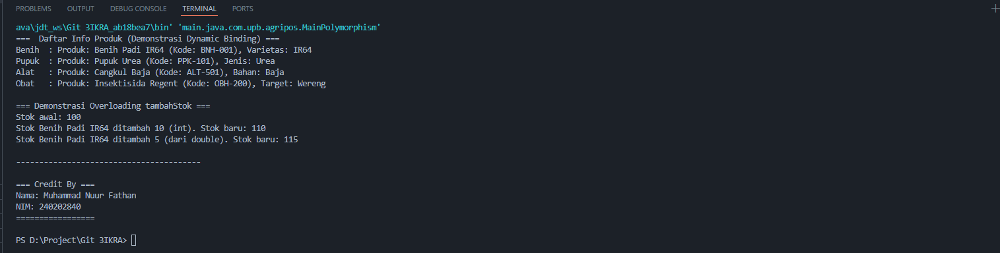

# Laporan Praktikum Minggu 4
Topik: Topik: Polymorphism (Info Produk)

## Identitas
- Nama  : Muhammad Nuur Fathan
- NIM   : 240202840
- Kelas : 3IKRA

---

## Tujuan
  - Mahasiswa mampu menjelaskan konsep polymorphism dalam OOP.
  - Mahasiswa mampu membedakan method overloading dan overriding.
  - Mahasiswa mampu mengimplementasikan polymorphism (overriding, overloading, dynamic binding) dalam program.
  - Mahasiswa mampu menganalisis contoh kasus polymorphism pada sistem nyata (Agri-POS).


---

## Dasar Teori
1.  **Polymorphism** (asal kata: "banyak bentuk") adalah konsep di OOP di mana sebuah objek dapat diperlakukan sebagai instance dari superclass-nya, namun saat method dipanggil, eksekusi yang terjadi adalah method dari subclass-nya.

2.  **Overloading** (Static Polymorphism): Terjadi ketika sebuah class memiliki dua atau lebih method dengan nama yang sama tetapi **daftar parameter (signature) yang berbeda** (berbeda tipe, jumlah, atau urutan). Method yang akan dipanggil ditentukan saat *compile time*.

3.  **Overriding** (Dynamic Polymorphism): Terjadi ketika subclass (anak) menyediakan implementasi spesifik untuk method yang sudah didefinisikan di superclass (induk). Method harus memiliki **nama, return type, dan daftar parameter yang sama persis** dengan superclass.

4.  **Dynamic Binding**: Ini adalah mekanisme inti dari overriding. Pada saat *runtime*, Java Virtual Machine (JVM) secara dinamis menentukan versi method mana yang harus dieksekusi berdasarkan **tipe objek aktual**, bukan tipe variabel referensinya.

---

## Langkah Praktikum
1. **Overloading**  
   - Tambahkan method `tambahStok(int jumlah)` dan `tambahStok(double jumlah)` pada class `Produk`.  

2. **Overriding**  
   - Tambahkan method `getInfo()` pada superclass `Produk`.  
   - Override method `getInfo()` pada subclass `Benih`, `Pupuk`, dan `AlatPertanian`.  

3. **Dynamic Binding**  
   - Buat array `Produk[] daftarProduk` yang berisi objek `Benih`, `Pupuk`, dan `AlatPertanian`.  
   - Loop array tersebut dan panggil `getInfo()`. Perhatikan bagaimana Java memanggil method sesuai jenis objek aktual.  

4. **Main Class**  
   - Buat `MainPolymorphism.java` untuk mendemonstrasikan overloading, overriding, dan dynamic binding.  

5. **CreditBy**  
   - Tetap panggil `CreditBy.print("<NIM>", "<Nama>")`.  

6. **Commit dan Push**  
   - Commit dengan pesan: `week4-polymorphism`.


---

## Kode Program
### Produk.java (Overloading & Base Method)

```java
package main.java.com.upb.agripos.model;


public class Produk {
    private String kode;
    private String nama;
    private double harga;
    private int stok;

    public Produk(String kode, String nama, double harga, int stok) {
        this.kode = kode;
        this.nama = nama;
        this.harga = harga;
        this.stok = stok;
    }

    public void tambahStok(int jumlah) {
        this.stok += jumlah;
        System.out.println("Stok " + this.nama + " ditambah " + jumlah + " (int). Stok baru: " + this.stok);
    }

    public void tambahStok(double jumlah) {
        this.stok += (int) jumlah;
        System.out.println("Stok " + this.nama + " ditambah " + (int)jumlah + " (dari double). Stok baru: " + this.stok);
    }

    public String getInfo() {
        return "Produk: " + nama + " (Kode: " + kode + ")";
    }

    public int getStok() {
        return stok;
    }

    public String getKode() {
        return kode;
    }

    public void setKode(String kode) {
        this.kode = kode;
    }

    public String getNama() {
        return nama;
    }

    public void setNama(String nama) {
        this.nama = nama;
    }

    public double getHarga() {
        return harga;
    }

    public void setHarga(double harga) {
        this.harga = harga;
    }
}
```

### Benih.java (Contoh Overriding)

```java
package main.java.com.upb.agripos.model;

public class Benih extends Produk {
    private String varietas;

    public Benih(String kode, String nama, double harga, int stok, String varietas) {
        super(kode, nama, harga, stok);
        this.varietas = varietas;
    }

    // --- OVERRIDING ---
    @Override
    public String getInfo() {
        // Memanggil getInfo() milik super, lalu menambahkan info spesifik
        return "Benih  : " + super.getInfo() + ", Varietas: " + varietas;
    }
}
```

### ObatHama.java (Latihan Mandiri Overriding)

```java
package main.java.com.upb.agripos.model;

public class ObatHama extends Produk {
    private String targetHama; 

    public ObatHama(String kode, String nama, double harga, int stok, String targetHama) {
        super(kode, nama, harga, stok);
        this.targetHama = targetHama;
    }

    // --- OVERRIDING ---
    @Override
    public String getInfo() {
        return "Obat   : " + super.getInfo() + ", Target: " + targetHama;
    }
}
```

### Pupuk.java (Latihan Mandiri Overriding)

```java
package main.java.com.upb.agripos.model;

public class Pupuk extends Produk {
    private String jenis; 

    public Pupuk(String kode, String nama, double harga, int stok, String jenis) {
        super(kode, nama, harga, stok);
        this.jenis = jenis;
    }

    @Override
    public String getInfo() {
        return "Pupuk  : " + super.getInfo() + ", Jenis: " + jenis;
    }
}
```

### AlatPertanian.java (Latihan Mandiri Overriding)

```java
package main.java.com.upb.agripos.model;

public class AlatPertanian extends Produk {
    private String bahan; 

    public AlatPertanian(String kode, String nama, double harga, int stok, String bahan) {
        super(kode, nama, harga, stok);
        this.bahan = bahan;
    }

    @Override
    public String getInfo() {
        return "Alat   : " + super.getInfo() + ", Bahan: " + bahan;
    }
}
```

### MainPolymorphism.java (Dynamic Binding)

```java
package main.java.com.upb.agripos;

import main.java.com.upb.agripos.model.Produk;
import main.java.com.upb.agripos.model.Benih;
import main.java.com.upb.agripos.model.Pupuk;
import main.java.com.upb.agripos.model.AlatPertanian;
import main.java.com.upb.agripos.model.ObatHama; // Untuk latihan mandiri
import main.java.com.upb.agripos.util.CreditBy;

public class MainPolymorphism {
    public static void main(String[] args) {
        
        // Array bertipe Superclass (Produk), diisi Objek Subclass
        Produk[] daftarProduk = {
            new Benih("BNH-001", "Benih Padi IR64", 25000, 100, "IR64"),
            new Pupuk("PPK-101", "Pupuk Urea", 350000, 40, "Urea"),
            new AlatPertanian("ALT-501", "Cangkul Baja", 90000, 15, "Baja"),
            new ObatHama("OBH-200", "Insektisida Regent", 75000, 50, "Wereng") // Latihan Mandiri
        };

        System.out.println("=== 📜 Daftar Info Produk (Demonstrasi Dynamic Binding) ===");
        
        // DYNAMIC BINDING terjadi di sini:
        for (Produk p : daftarProduk) {
            // p.getInfo() akan memanggil method milik subclass-nya
            System.out.println(p.getInfo()); 
        }

        System.out.println("\n=== Demonstrasi Overloading tambahStok ===");
        Produk produkTes = daftarProduk[0]; // Ambil Benih Padi (Stok awal 100)
        
        System.out.println("Stok awal: " + produkTes.getStok()); 
        
        produkTes.tambahStok(10);     // Memanggil tambahStok(int)
        produkTes.tambahStok(5.5);    // Memanggil tambahStok(double)

        
        System.out.println("\n----------------------------------------");
        CreditBy.print("240202840", "Muhammad Nuur Fathan");
    }
}
```

### CreditBy.java

```java
package main.java.com.upb.agripos.util;

public class CreditBy {
    public static void print(String nim, String nama) {
        System.out.println("\n=== Credit By ===");
        System.out.println("Dikembangkan oleh: " + nama);
        System.out.println("NIM: " + nim);
        System.out.println("=================\n");
    }
}
```

---

## Hasil Eksekusi


---

## Analisis
  - **Cara Kerja Kode:** Program utama (`MainPolymorphism`) menginisialisasi sebuah array `Produk[]` yang berisi empat objek subclass (`Benih`, `Pupuk`, `AlatPertanian`, `ObatHama`). Saat program melakukan iterasi pada array ini, variabel `p` memiliki tipe *referensi* `Produk`. Namun, ketika `p.getInfo()` dipanggil, **Dynamic Binding**  terjadi: JVM memeriksa tipe *objek aktual* saat runtime dan memanggil method `getInfo()` yang telah di-override di subclass yang sesuai (misal, `getInfo()` milik `Benih` saat `p` menunjuk ke objek `Benih`).
  - **Demo Overloading:** Program juga mendemonstrasikan **Overloading** dengan sukses. Pemanggilan `produkTes.tambahStok(10)` memanggil versi `(int)`, dan `produkTes.tambahStok(5.5)` memanggil versi `(double)`, yang terlihat jelas dari output cetak yang berbeda (`(int)` vs `(dari double)`).
  - **Perbedaan vs Minggu Sebelumnya:** Minggu lalu (Inheritance) kita fokus pada *mewarisi* properti dan method. Minggu ini (Polymorphism), kita fokus pada *mengubah perilaku* method yang diwarisi tersebut (overriding) dan *memperlakukan objek-objek berbeda* seolah-olah mereka satu tipe yang sama (dynamic binding dalam array).
  - **Kendala:** Tidak ada kendala signifikan. Kode berjalan sesuai ekspektasi. Implementasi Latihan Mandiri (`ObatHama`) juga berhasil diintegrasikan ke dalam array `daftarProduk` dan menampilkan output yang benar.

---

## Kesimpulan

1.  **Polymorphism** memungkinkan kode yang lebih fleksibel dan mudah dipelihara. Kita dapat menulis kode generik (seperti loop `for (Produk p : ...)` ) yang dapat bekerja dengan berbagai objek subclass (Benih, Pupuk, dll) tanpa perlu mengetahui tipe spesifiknya.
2.  **Overloading** (`tambahStok`) berhasil diimplementasikan untuk menyediakan fungsionalitas yang sama (menambah stok) dengan tipe input yang berbeda (int dan double).
3.  **Overriding** (`getInfo`) dan **Dynamic Binding** berhasil diimplementasikan, di mana setiap subclass menyediakan detailnya sendiri saat `getInfo()` dipanggil melalui referensi superclass `Produk`.
4.  Latihan Mandiri untuk membuat class `ObatHama` berhasil diselesaikan dan diintegrasikan ke dalam demonstrasi polymorphism.


---

## Quiz
1.  **Apa perbedaan overloading dan overriding?**
    **Jawaban:**

      * **Overloading** (Polimorfisme Statis): Terjadi dalam **satu class**. Method memiliki **nama sama** tapi **parameter berbeda** (jumlah atau tipe). Ditentukan saat *compile time*.
      * **Overriding** (Polimorfisme Dinamis): Terjadi antara **superclass dan subclass**. Method memiliki **nama dan parameter sama persis**. Implementasi di subclass "menggantikan" implementasi superclass. Ditentukan saat *runtime*.

2.  **Bagaimana Java menentukan method mana yang dipanggil dalam dynamic binding?**
    **Jawaban:** Java menentukannya pada saat **runtime** (saat program berjalan). Java **melihat tipe objek aktual** (misal: objek `new Benih()`) yang sedang ditunjuk oleh variabel, bukan tipe variabel referensinya (misal: `Produk p`).

3.  **Berikan contoh kasus polymorphism dalam sistem POS selain produk pertanian.**
    **Jawaban:** Dalam sistem POS Supermarket, bisa ada superclass `Diskon`. Subclass-nya bisa `DiskonPersentase` (potong 10%), `DiskonNominal` (potong Rp 5.000), dan `DiskonBeli1Gratis1`. Semuanya meng-override method `double hitungTotal(double hargaAsli)`. Saat kasir memanggil `diskon.hitungTotal(100000)`, program akan menjalankan logika yang berbeda (mengalikan 0.9, mengurangi 5000, atau menghitung harga barang gratis) tergantung jenis diskon yang diterapkan.
