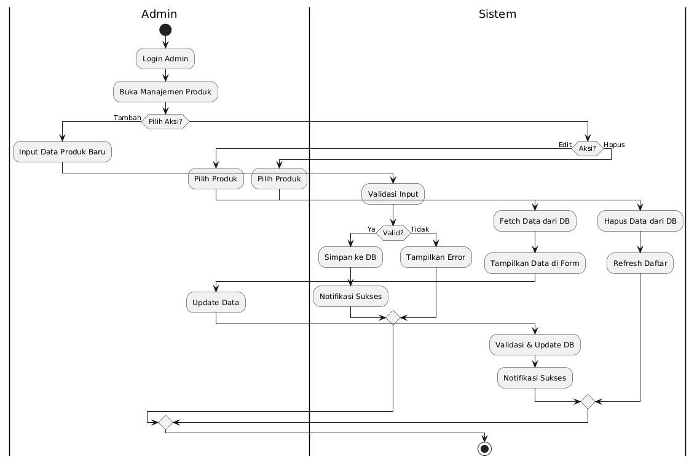
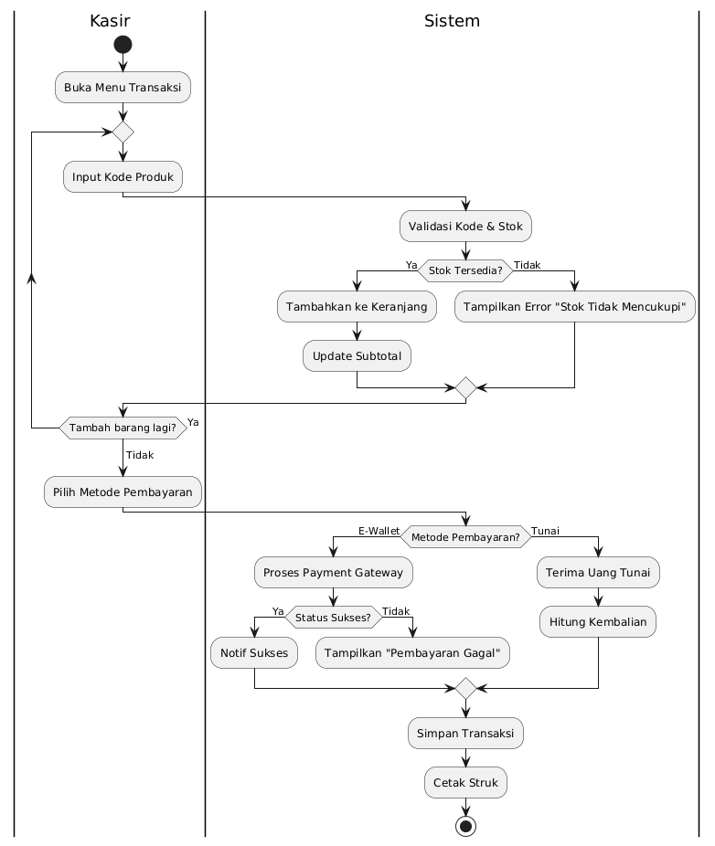
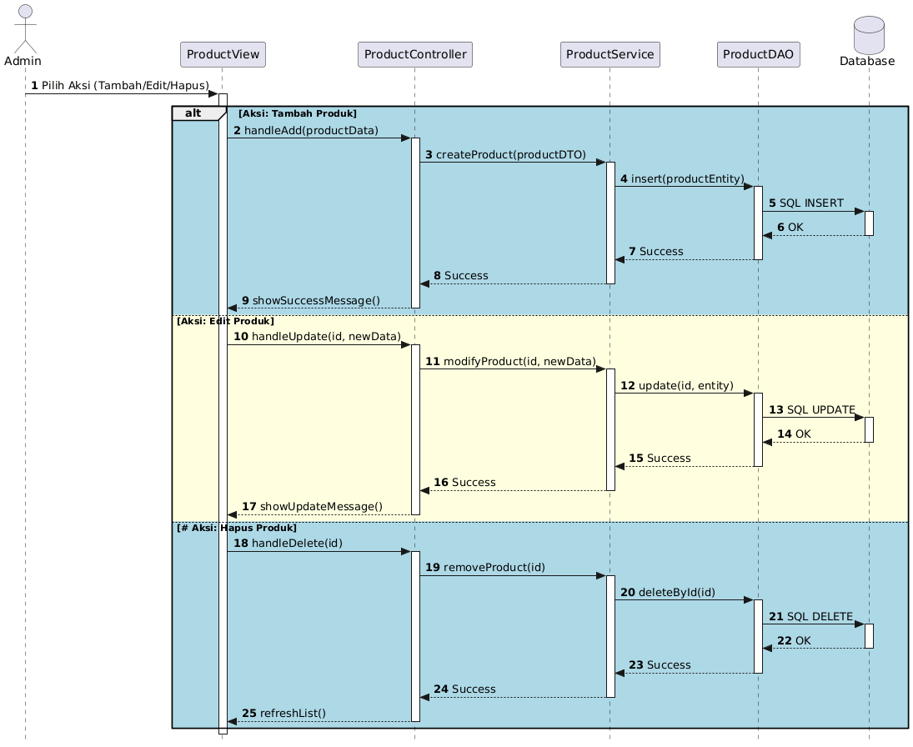
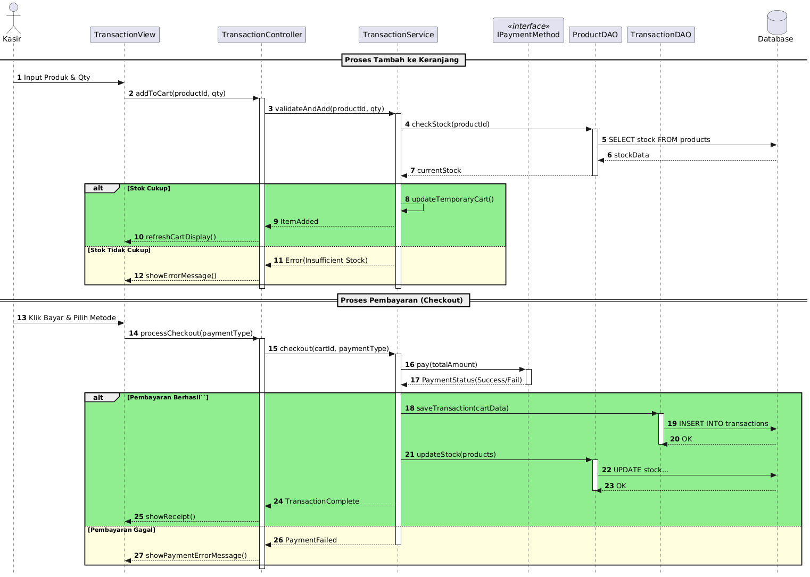
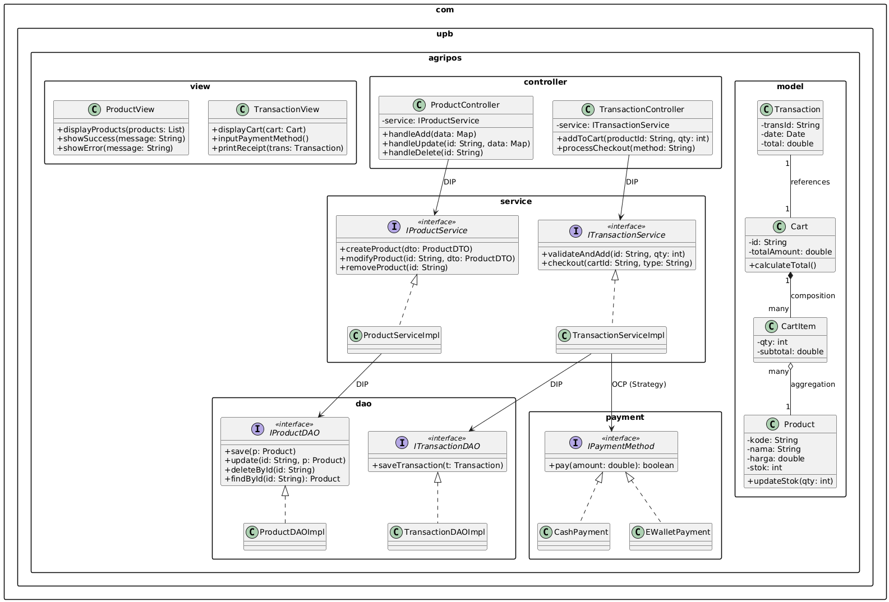

# Laporan Praktikum Minggu 6
Topik: Desain Arsitektur Sistem dengan UML dan Prinsip SOLID

## Identitas
- Nama  : Muhammad Nuur Fathan
- NIM   : 240202840
- Kelas : 3IKRA

---

## Tujuan
1. Mahasiswa mampu mengidentifikasi kebutuhan sistem ke dalam diagram UML.
2. Mahasiswa mampu menggambar UML Class Diagram dengan relasi antar class yang tepat.
3. Mahasiswa mampu menjelaskan prinsip desain OOP (SOLID).
4. Mahasiswa mampu menerapkan minimal dua prinsip SOLID dalam desain arsitektur.

---

## Dasar Teori
1. **UML (Unified Modeling Language):** Bahasa standar untuk memvisualisasikan dan mendokumentasikan struktur serta perilaku sistem.
2. **SOLID Principles:** Lima prinsip desain kelas (SRP, OCP, LSP, ISP, DIP) yang bertujuan agar sistem lebih mudah dipelihara dan dikembangkan.
3. **Behavioral Diagrams:** Diagram seperti *Use Case*, *Activity*, dan *Sequence* digunakan untuk memodelkan interaksi dan alur kerja pengguna.
4. **Structural Diagrams:** *Class Diagram* digunakan untuk memodelkan struktur statis, hubungan antar objek, serta enkapsulasi data.

---

## Langkah Praktikum
1. **Pemetaan Kebutuhan:** Mengidentifikasi aktor Admin dan Kasir serta fungsionalitas utama seperti CRUD produk dan transaksi penjualan.
2. **Desain Use Case:** Membuat diagram yang menghubungkan aktor dengan fungsionalitas utama sistem.
3. **Desain Activity:** Menyusun alur login dan manajemen produk untuk Admin, serta alur scan item hingga cetak struk untuk Kasir.
4. **Desain Sequence:** Memodelkan interaksi objek `CheckoutController` dengan `ShoppingCartMap`, `DiscountStrategy`, dan `PaymentService`.
5. **Desain Class Diagram:** Mengelompokkan kelas ke dalam paket (Model, Controller, Service, Abstraction) dan menerapkan prinsip SOLID.

---

## Hasil Desain UML

**Usecase diagram :**

Diagram ini memetakan hubungan antara aktor dan fungsi utama di dalam sistem:

* **Aktor:** Terdiri dari **Admin** dan **Kasir**.
* **Fungsi Admin:** Fokus pada manajemen tingkat tinggi seperti **Kelola Produk (CRUD)** dan **Lihat Laporan Penjualan**.
* **Fungsi Kasir:** Fokus pada operasional yaitu **Mulai Transaksi (Checkout)** yang secara otomatis mencakup pemilihan metode pembayaran dan pencetakan struk.
* **Fungsi Bersama:** Kedua aktor harus melalui proses **Login & Autentikasi** untuk mengakses sistem.
---
**Activity diagram Manajeme produk :**

* **Autentikasi:** Admin harus melalui proses *Login* sebelum masuk ke menu manajemen.
* **Operasi CRUD:** Sistem menyediakan percabangan untuk aksi **Tambah, Edit, dan Hapus**.
* **Validasi & Feedback:** Setiap input divalidasi oleh sistem. Jika valid, data disimpan ke DB dan muncul "Notifikasi Sukses"; jika tidak, sistem menampilkan pesan *error*.
* **Sinkronisasi:** Pada proses Edit dan Hapus, sistem melakukan *fetch* data terbaru untuk memastikan data yang diubah adalah data yang valid.

---

**Activity Diagram (Kasir - Transaksi):**

* **Looping Produk:** Kasir dapat memasukkan kode produk berulang kali (`Tambah barang lagi?`) selama stok tersedia.
* **Validasi Stok:** Sistem secara otomatis mengecek ketersediaan stok sebelum memasukkan barang ke keranjang.
* **Metode Pembayaran:** Terdapat percabangan logika antara pembayaran **Tunai** (menghitung kembalian) dan **E-Wallet** (melalui *Payment Gateway*).
* **Finalisasi:** Transaksi hanya akan disimpan dan struk dicetak jika status pembayaran dinyatakan sukses.

---

**Sequence Diagram (Admin - CRUD Produk):**

* **Penerapan Layering:** Terlihat alur yang rapi dari `ProductView` -> `ProductController` -> `ProductService` -> `ProductDAO` -> `Database`.
* **Fragment Alt:** Menggunakan blok *alt* untuk memisahkan logika penambahan, pengubahan, dan penghapusan data dalam satu diagram urutan yang jelas.

---

---

**Sequence Diagram (Kasir - Transaksi & Checkout):**

* **Proses Tambah ke Keranjang:** Melibatkan pengecekan stok ke `ProductDAO` sebelum memperbarui tampilan keranjang.
* **Proses Pembayaran:** Menunjukkan penggunaan *interface* `IPaymentMethod` yang memungkinkan sistem memproses berbagai jenis pembayaran secara polimorfik.
* **Integritas Data:** Setelah pembayaran berhasil, sistem melakukan pembaruan stok (`updateStock`) dan menyimpan detail transaksi secara atomik.

---

**Class diagram :**

* **Organisasi Package:** Kode dibagi menjadi `view`, `controller`, `service`, `dao`, `payment`, dan `model`.
* **Relasi Objek:**
* **Composition:** `Cart` memiliki `CartItem` (jika Cart dihapus, item di dalamnya ikut hilang).
* **Aggregation:** `CartItem` merujuk ke `Product` (produk tetap ada di sistem meskipun item dihapus dari keranjang).
* **Abstraction:** Penggunaan *interface* seperti `IProductService` dan `IPaymentMethod` untuk mendukung fleksibilitas kode.

---

## Penerapan Prinsip SOLID

Desain ini secara eksplisit menerapkan prinsip SOLID sebagai berikut:

* **S - Single Responsibility Principle (SRP):**
Pemisahan yang jelas antara `ProductController` (mengatur alur input), `ProductService` (logika bisnis), dan `ProductDAO` (akses database).
* **O - Open/Closed Principle (OCP):**
Terlihat pada package `payment`. Dengan adanya *interface* **`IPaymentMethod`**, kita bisa menambah metode pembayaran baru (misal: *CryptoPayment*) tanpa mengubah logika di `TransactionService`.
* **L - Liskov Substitution Principle (LSP):**
**`CashPayment`** dan **`EWalletPayment`** dapat menggantikan **`IPaymentMethod`** tanpa merusak alur proses `checkout`.
* **I - Interface Segregation Principle (ISP):**
Setiap *interface* (`IProductService`, `ITransactionService`) dibuat spesifik untuk tugasnya masing-masing, tidak digabung menjadi satu *interface* besar yang "gemuk".
* **D - Dependency Inversion Principle (DIP):**
Controller tidak bergantung langsung pada kelas implementasi (`ServiceImpl`), melainkan bergantung pada abstraksi (*interface*). Ini ditandai dengan label **DIP** pada panah relasi di Class Diagram.

---

## Tabel Traceability

| Functional Requirement (FR) | Use Case | Activity / Sequence Diagram | Class & Interface Utama |
| :--- | :--- | :--- | :--- |
| **Manajemen Produk** | Kelola Produk (CRUD) | Activity Manajemen Produk / Sequence Admin | `ProductController`, `IProductService`, `IProductDAO`, `Product` |
| **Transaksi Penjualan** | Input Barang & Update Keranjang | Activity Transaksi / Sequence Kasir | `TransactionController`, `ITransactionService`, `Cart`, `CartItem` |
| **Manajemen Stok** | Validasi & Update Stok Otomatis | Activity Transaksi (Sistem) / Sequence Kasir | `ProductDAO`, `Product` (metode `updateStok`) |
| **Metode Pembayaran** | Pilih & Proses Pembayaran | Activity Transaksi / Sequence Kasir | `IPaymentMethod`, `CashPayment`, `EWalletPayment` |
| **Penyimpanan Data** | Simpan Transaksi & Cetak Struk | Sequence Kasir (Checkout) | `ITransactionDAO`, `Transaction`, `TransactionView` |

---

## Analisis
* **Proses Inisiasi:** Saat kasir memicu fungsi `checkout()`, controller akan mengambil data dari `ShoppingCartMap` untuk menghitung total belanja dasar.
* **Penerapan Strategi:** Sebelum pembayaran, controller menggunakan objek yang mengimplementasikan `DiscountStrategy` untuk menghitung potongan harga secara dinamis tanpa mengubah logika internal controller.
* **Eksekusi Pembayaran:** `PaymentService` akan menjalankan proses pembayaran berdasarkan objek `Pembayaran` yang dipilih (Polimorfisme). Sistem kemudian melakukan validasi (jika digital) dan mengecek status `isSuccess`.
* **Finalisasi:** Jika berhasil, `StockService` akan memperbarui stok di database dan sistem akan memicu fungsi cetak dari interface `Receiptable`

---

## Kesimpulan

Perancangan arsitektur Agri-POS menggunakan UML ini telah memenuhi standar rekayasa perangkat lunak yang sistematis. Penerapan prinsip SOLID menjadikan sistem ini modular, mudah diuji (*testable*), dan siap untuk dikembangkan secara berkelanjutan sesuai kebutuhan domain pertanian digital.

---

## Quiz

Sesuai dengan pertanyaan pada panduan praktikum:

1. **Jelaskan perbedaan aggregation dan composition serta contoh penerapannya pada desain Anda.**
* **Jawaban:** *Aggregation* adalah hubungan "memiliki" yang lemah (induk dihapus, bagian tetap ada), contohnya `ShoppingCartMap` dengan `Produk`. *Composition* adalah hubungan yang kuat (induk dihapus, bagian ikut terhapus), contohnya `ShoppingCartMap` dengan `CartItem`.

2. **Bagaimana prinsip Open/Closed dapat memastikan sistem mudah dikembangkan?**
* **Jawaban:** Dengan menggunakan abstraksi (interface), fitur baru ditambahkan melalui pembuatan kelas baru (ekstensi) tanpa mengubah kode lama (modifikasi), sehingga meminimalisir risiko munculnya *bug* pada fitur yang sudah ada.

3. **Mengapa Dependency Inversion Principle (DIP) meningkatkan testability? Berikan contohnya.**
* **Jawaban:** DIP memisahkan ketergantungan antar kelas melalui interface. Ini memungkinkan kita menggunakan *Mock Object* untuk menggantikan komponen asli saat pengujian. Contoh: Mengganti `:ExternalAPI` dengan simulasi respon sukses/gagal saat melakukan pengujian pada `PaymentService`.

---
