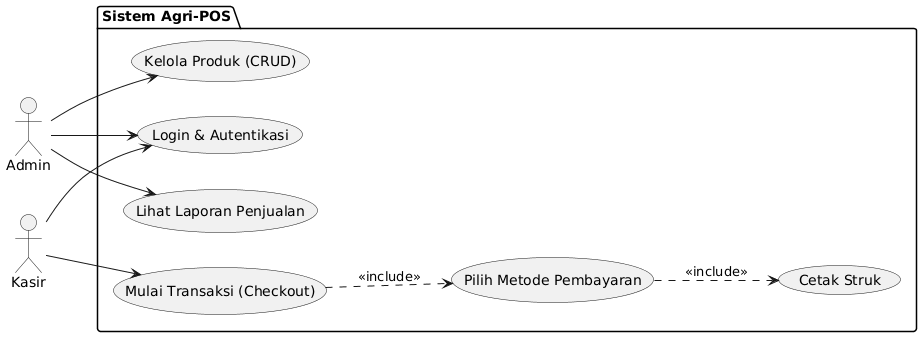
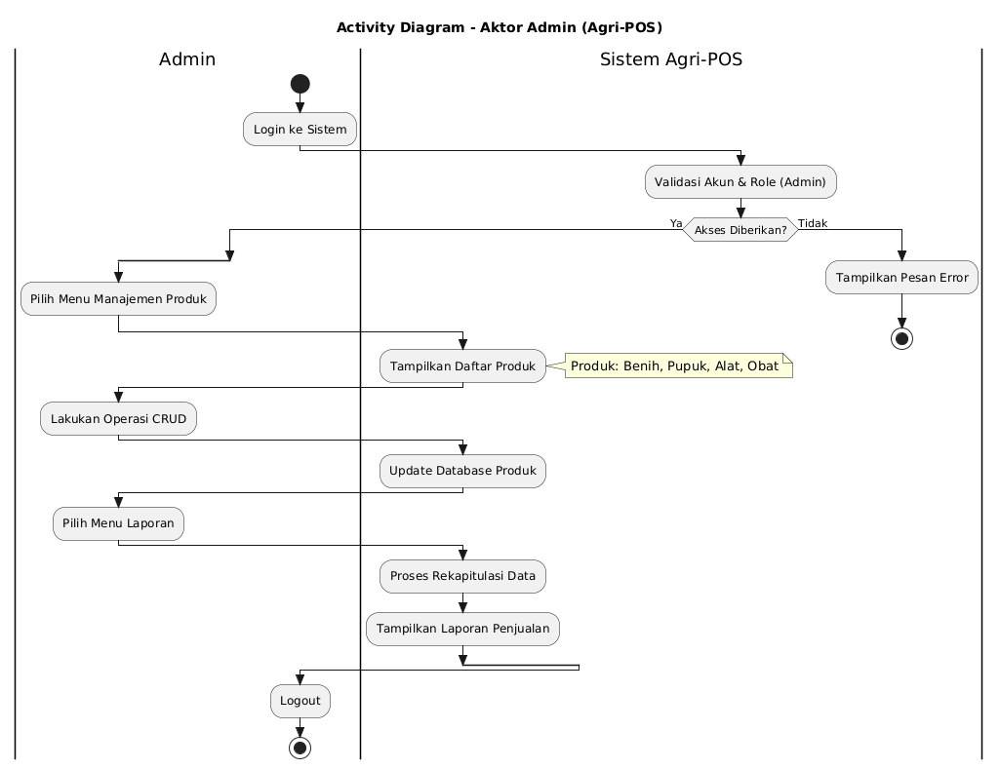
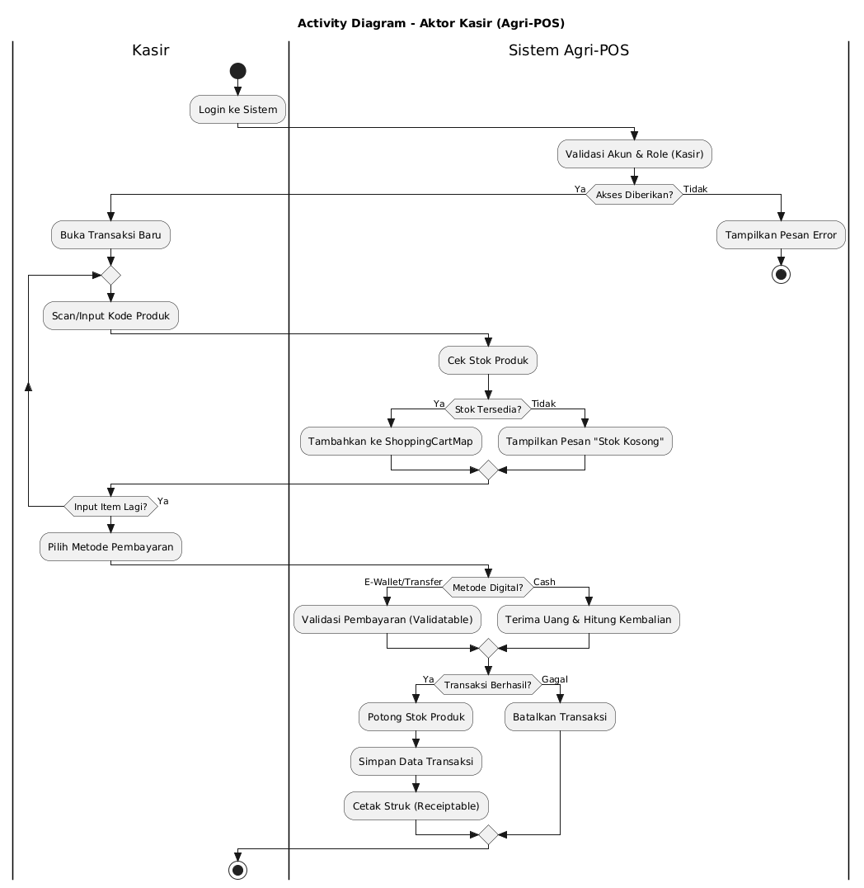
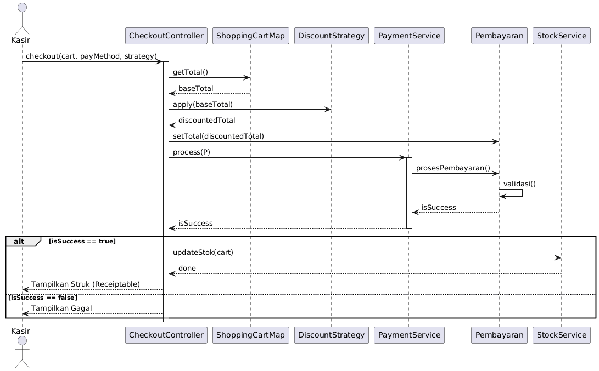
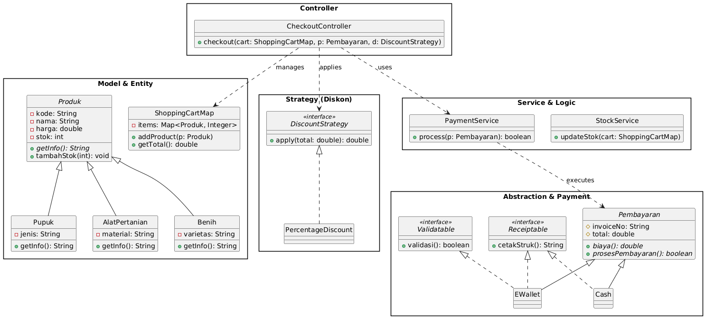

# Laporan Praktikum Minggu 6
Topik: Desain Arsitektur Sistem dengan UML dan Prinsip SOLID

## Identitas
- Nama  : Muhammad Nuur Fathan
- NIM   : 240202840
- Kelas : 3IKRA

---

## Tujuan
1. Mahasiswa mampu mengidentifikasi kebutuhan sistem ke dalam diagram UML.
2. Mahasiswa mampu menggambar UML Class Diagram dengan relasi antar class yang tepat.
3. Mahasiswa mampu menjelaskan prinsip desain OOP (SOLID).
4. Mahasiswa mampu menerapkan minimal dua prinsip SOLID dalam desain arsitektur.

---

## Dasar Teori
1. **UML (Unified Modeling Language):** Bahasa standar untuk memvisualisasikan dan mendokumentasikan struktur serta perilaku sistem.
2. **SOLID Principles:** Lima prinsip desain kelas (SRP, OCP, LSP, ISP, DIP) yang bertujuan agar sistem lebih mudah dipelihara dan dikembangkan.
3. **Behavioral Diagrams:** Diagram seperti *Use Case*, *Activity*, dan *Sequence* digunakan untuk memodelkan interaksi dan alur kerja pengguna.
4. **Structural Diagrams:** *Class Diagram* digunakan untuk memodelkan struktur statis, hubungan antar objek, serta enkapsulasi data.

---

## Langkah Praktikum
1. **Pemetaan Kebutuhan:** Mengidentifikasi aktor Admin dan Kasir serta fungsionalitas utama seperti CRUD produk dan transaksi penjualan.
2. **Desain Use Case:** Membuat diagram yang menghubungkan aktor dengan fungsionalitas utama sistem.
3. **Desain Activity:** Menyusun alur login dan manajemen produk untuk Admin, serta alur scan item hingga cetak struk untuk Kasir.
4. **Desain Sequence:** Memodelkan interaksi objek `CheckoutController` dengan `ShoppingCartMap`, `DiscountStrategy`, dan `PaymentService`.
5. **Desain Class Diagram:** Mengelompokkan kelas ke dalam paket (Model, Controller, Service, Abstraction) dan menerapkan prinsip SOLID.

---

## Hasil Desain UML

**Usecase diagram :**

Diagram ini memetakan hubungan antara aktor dan fungsi utama di dalam sistem:

* **Aktor:** Terdiri dari **Admin** dan **Kasir**.
* **Fungsi Admin:** Fokus pada manajemen tingkat tinggi seperti **Kelola Produk (CRUD)** dan **Lihat Laporan Penjualan**.
* **Fungsi Kasir:** Fokus pada operasional yaitu **Mulai Transaksi (Checkout)** yang secara otomatis mencakup pemilihan metode pembayaran dan pencetakan struk.
* **Fungsi Bersama:** Kedua aktor harus melalui proses **Login & Autentikasi** untuk mengakses sistem.
---
**Activity diagram (Admin) :**

* **Aktor Kasir:** Menjelaskan siklus transaksi mulai dari scan produk, pengecekan stok otomatis oleh sistem, hingga percabangan metode pembayaran (Cash vs Digital). Jika transaksi gagal, sistem akan membatalkan proses; jika berhasil, sistem akan memotong stok dan mencetak struk.
* **Aktor Admin:** Menjelaskan alur manajemen data, di mana Admin dapat melakukan operasi CRUD pada database produk dan melihat rekapitulasi laporan penjualan yang diproses oleh sistem.
---

**Activity diagram (Kasir) :**

* **Aktor Admin:** Menjelaskan alur manajemen data, di mana Admin dapat melakukan operasi CRUD pada database produk dan melihat rekapitulasi laporan penjualan yang diproses oleh sistem.
---

**Sequence diagram :**

Diagram ini menunjukkan interaksi antar objek berdasarkan urutan waktu selama proses **Checkout** berlangsung:

* **Interaksi Utama:** `CheckoutController` menjadi koordinator yang memanggil `ShoppingCartMap` untuk total harga, `DiscountStrategy` untuk menghitung diskon, dan `PaymentService` untuk memproses pembayaran.
* **Logika Kondisional:** Menggunakan blok **alt** untuk menangani skenario jika pembayaran berhasil (update stok dan cetak struk) atau jika pembayaran gagal.
---

**Class diagram :**

iagram ini menunjukkan struktur teknis, organisasi kode, dan penerapan prinsip **SOLID**:

* **Model & Entity:** Menunjukkan hierarki produk (**Benih, Pupuk, Alat**) yang mewarisi sifat dari class `Produk`.
* **Strategy Pattern:** Digunakan pada `DiscountStrategy` untuk memungkinkan perubahan logika diskon tanpa mengubah kode controller (Open/Closed Principle).
* **Abstraction & Interface:** Penggunaan interface `Validatable` dan `Receiptable` menunjukkan penerapan *Interface Segregation*, di mana metode pembayaran hanya mengimplementasikan apa yang mereka butuhkan.
* **Service & Controller:** Memisahkan logika bisnis (`StockService`, `PaymentService`) dari pengatur alur (`CheckoutController`) untuk menjaga *Single Responsibility*.
---

## Penerapan Prinsip SOLID

Desain ini secara eksplisit menerapkan prinsip SOLID sebagai berikut:

* **S - Single Responsibility Principle (SRP):**
Setiap kelas dalam desain memiliki tanggung jawab tunggal dan spesifik. Hal ini terlihat pada pemisahan **`StockService`** yang hanya menangani pembaruan stok, **`PaymentService`** untuk logika pembayaran, dan **`CheckoutController`** sebagai koordinator alur transaksi.
* **O - Open/Closed Principle (OCP):**
Sistem didesain agar terbuka untuk pengembangan tetapi tertutup untuk modifikasi. Dengan adanya interface **`DiscountStrategy`** dan class abstrak **`Pembayaran`**, Anda dapat menambah jenis diskon baru (misal: *SeasonalDiscount*) atau metode pembayaran baru (misal: *QRIS*) tanpa perlu mengubah kode inti pada **`CheckoutController`**.
* **L - Liskov Substitution Principle (LSP):**
Objek dari sub-kelas harus dapat menggantikan objek dari super-kelasnya tanpa merusak fungsionalitas sistem. Pada diagram Anda, kelas **`Benih`**, **`Pupuk`**, dan **`AlatPertanian`** adalah turunan dari **`Produk`**; mereka dapat digunakan secara bergantian dalam **`ShoppingCartMap`** karena semuanya mematuhi kontrak yang didefinisikan di kelas induk.
* **I - Interface Segregation Principle (ISP):**
Penggunaan interface yang spesifik lebih baik daripada satu interface besar. Pemisahan antara **`Validatable`** (untuk validasi digital) dan **`Receiptable`** (untuk pencetakan struk) sangat tepat; kelas **`Cash`** hanya mengimplementasikan **`Receiptable`** karena tidak memerlukan validasi digital, sementara **`EWallet`** mengimplementasikan keduanya.
* **D - Dependency Inversion Principle (DIP):**
Kelas tingkat tinggi tidak boleh bergantung pada kelas tingkat rendah, keduanya harus bergantung pada abstraksi. **`CheckoutController`** dan **`PaymentService`** tidak bergantung langsung pada kelas konkrit seperti **`EWallet`**, melainkan berinteraksi melalui abstraksi interface/class abstrak seperti **`DiscountStrategy`** dan **`Pembayaran`**.

---

## Tabel Traceability

| FR | Use Case | Activity/Sequence | Class/Interface |
| --- | --- | --- | --- |
| Manajemen Produk | Kelola Produk (CRUD) | Activity Admin | Produk, Pupuk, AlatPertanian, Benih |
| Transaksi Penjualan | Mulai Transaksi (Checkout) | Sequence Checkout | CheckoutController, ShoppingCartMap |
| Metode Pembayaran | Pilih Metode Pembayaran | Seq Pembayaran | Pembayaran, EWallet, Cash |
| Diskon & Promosi | (Optional) | Sequence Checkout | DiscountStrategy, PercentageDiscount |

---

## Analisis
* **Proses Inisiasi:** Saat kasir memicu fungsi `checkout()`, controller akan mengambil data dari `ShoppingCartMap` untuk menghitung total belanja dasar.
* **Penerapan Strategi:** Sebelum pembayaran, controller menggunakan objek yang mengimplementasikan `DiscountStrategy` untuk menghitung potongan harga secara dinamis tanpa mengubah logika internal controller.
* **Eksekusi Pembayaran:** `PaymentService` akan menjalankan proses pembayaran berdasarkan objek `Pembayaran` yang dipilih (Polimorfisme). Sistem kemudian melakukan validasi (jika digital) dan mengecek status `isSuccess`.
* **Finalisasi:** Jika berhasil, `StockService` akan memperbarui stok di database dan sistem akan memicu fungsi cetak dari interface `Receiptable`

---

## Kesimpulan

Perancangan arsitektur Agri-POS menggunakan UML ini telah memenuhi standar rekayasa perangkat lunak yang sistematis. Penerapan prinsip SOLID menjadikan sistem ini modular, mudah diuji (*testable*), dan siap untuk dikembangkan secara berkelanjutan sesuai kebutuhan domain pertanian digital.

---

## Quiz

Sesuai dengan pertanyaan pada panduan praktikum:

1. **Jelaskan perbedaan aggregation dan composition serta contoh penerapannya pada desain Anda.**
* **Jawaban:** *Aggregation* adalah hubungan "memiliki" yang lemah (induk dihapus, bagian tetap ada), contohnya `ShoppingCartMap` dengan `Produk`. *Composition* adalah hubungan yang kuat (induk dihapus, bagian ikut terhapus), contohnya `ShoppingCartMap` dengan `CartItem`.

2. **Bagaimana prinsip Open/Closed dapat memastikan sistem mudah dikembangkan?**
* **Jawaban:** Dengan menggunakan abstraksi (interface), fitur baru ditambahkan melalui pembuatan kelas baru (ekstensi) tanpa mengubah kode lama (modifikasi), sehingga meminimalisir risiko munculnya *bug* pada fitur yang sudah ada.

3. **Mengapa Dependency Inversion Principle (DIP) meningkatkan testability? Berikan contohnya.**
* **Jawaban:** DIP memisahkan ketergantungan antar kelas melalui interface. Ini memungkinkan kita menggunakan *Mock Object* untuk menggantikan komponen asli saat pengujian. Contoh: Mengganti `:ExternalAPI` dengan simulasi respon sukses/gagal saat melakukan pengujian pada `PaymentService`.

---
