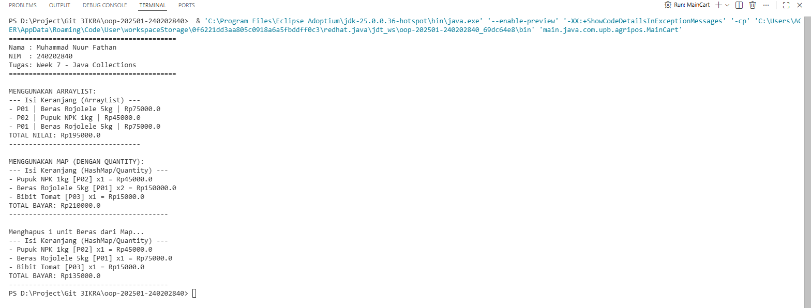

# Laporan Praktikum Minggu 7
Topik: **Collections dan Implementasi Keranjang Belanja (Agri-POS)**

## Identitas
- Nama  : [Muhammad Nuur Fathan]
- NIM   : [240202840]
- Kelas : [3IKRA]

---

## Tujuan
1. Mahasiswa mampu memahami dan mengimplementasikan Java Collections Framework (List dan Map).
2. Mahasiswa dapat mengelola data objek secara dinamis menggunakan `ArrayList`.
3. Mahasiswa mampu menangani logika jumlah barang (*quantity*) menggunakan `HashMap`.
4. Mahasiswa dapat melakukan operasi CRUD dasar (tambah, hapus, hitung total) pada sistem keranjang belanja.

---

## Dasar Teori
1. **Java Collections Framework**: Sekumpulan antarmuka dan kelas yang digunakan untuk menyimpan dan memanipulasi grup objek secara dinamis.
2. **List (ArrayList)**: Koleksi yang terurut dan memperbolehkan elemen duplikat. Sangat efisien untuk penambahan data di akhir list.
3. **Map (HashMap)**: Struktur data yang menyimpan pasangan *Key-Value*. Digunakan untuk memetakan produk ke jumlahnya (*quantity*), memudahkan pencarian tanpa iterasi panjang.
4. **Hashing**: Mekanisme yang digunakan `HashSet` atau `HashMap` untuk memastikan keunikan *key* melalui metode `hashCode()` dan `equals()`.

---

## Langkah Praktikum
1. **Setup Package**: Membuat package `com.upb.agripos` di dalam folder `src/main/java`.
2. **Membuat Model**: Membuat class `Product` dengan atribut kode, nama, dan harga. Menambahkan `equals()` dan `hashCode()` untuk mendukung penggunaan dalam Map.
3. **Implementasi Keranjang**:
* Membuat `ShoppingCart` menggunakan `ArrayList`.
* Membuat `ShoppingCartMap` menggunakan `HashMap` untuk fitur quantity.
4. **Main Program**: Membuat `MainCart.java` untuk mensimulasikan proses tambah dan hapus barang.
5. **Verifikasi**: Menjalankan program dan mendokumentasikan hasil output terminal.
6. **Git**: Melakukan commit dengan pesan sesuai standar praktikum.

---

## Kode Program

### Maincart.java

```java

package main.java.com.upb.agripos;

public class MainCart {
    public static void main(String[] args) {
        System.out.println("==========================================");
        System.out.println("Nama : Muhammad Nuur Fathan");
        System.out.println("NIM  : 240202840");
        System.out.println("Tugas: Week 7 - Java Collections");
        System.out.println("==========================================\n");

        Product p1 = new Product("P01", "Beras Rojolele 5kg", 75000);
        Product p2 = new Product("P02", "Pupuk NPK 1kg", 45000);
        Product p3 = new Product("P03", "Bibit Tomat", 15000);

        System.out.println("MENGGUNAKAN ARRAYLIST:");
        ShoppingCart cartList = new ShoppingCart();
        cartList.addProduct(p1);
        cartList.addProduct(p2);
        cartList.addProduct(p1); // Beras ditambah lagi (muncul 2 baris)
        cartList.printCart();

        System.out.println("\nMENGGUNAKAN MAP (DENGAN QUANTITY):");
        ShoppingCartMap cartMap = new ShoppingCartMap();
        cartMap.addProduct(p1);
        cartMap.addProduct(p1); // Beras x2
        cartMap.addProduct(p2); // Pupuk x1
        cartMap.addProduct(p3); // Bibit x1
        cartMap.printCart();

        // Contoh Hapus Produk
        System.out.println("\nMenghapus 1 unit Beras dari Map...");
        cartMap.removeProduct(p1);
        cartMap.printCart();
    }
}
```
---
### Product.java

```java

package main.java.com.upb.agripos;


import java.util.Objects;

public class Product {
    private final String code;
    private final String name;
    private final double price;

    public Product(String code, String name, double price) {
        this.code = code;
        this.name = name;
        this.price = price;
    }

    public String getCode() { return code; }
    public String getName() { return name; }
    public double getPrice() { return price; }

    // Wajib ada agar HashMap bisa mengenali produk yang sama
    @Override
    public boolean equals(Object o) {
        if (this == o) return true;
        if (o == null || getClass() != o.getClass()) return false;
        Product product = (Product) o;
        return Objects.equals(code, product.code);
    }

    @Override
    public int hashCode() {
        return Objects.hash(code);
    }
}
```
---
### ShoppingCart.java

```java

package main.java.com.upb.agripos;

import java.util.ArrayList;

public class ShoppingCart {
    private final ArrayList<Product> items = new ArrayList<>();

    public void addProduct(Product p) { 
        items.add(p); 
    }

    public void removeProduct(Product p) { 
        items.remove(p); 
    }

    public double getTotal() {
        double sum = 0;
        for (Product p : items) {
            sum += p.getPrice();
        }
        return sum;
    }

    public void printCart() {
        System.out.println("--- Isi Keranjang (ArrayList) ---");
        for (Product p : items) {
            System.out.println("- " + p.getCode() + " | " + p.getName() + " | Rp" + p.getPrice());
        }
        System.out.println("TOTAL NILAI: Rp" + getTotal());
        System.out.println("---------------------------------");
    }
}
```
---

### ShoppingCartMap.java

```java

package main.java.com.upb.agripos;

import java.util.HashMap;
import java.util.Map;

public class ShoppingCartMap {
    private final Map<Product, Integer> items = new HashMap<>();

    public void addProduct(Product p) { 
        // getOrDefault mengambil qty lama, jika belum ada set 0, lalu tambah 1
        items.put(p, items.getOrDefault(p, 0) + 1); 
    }

    public void removeProduct(Product p) {
        if (!items.containsKey(p)) return;
        
        int qty = items.get(p);
        if (qty > 1) {
            items.put(p, qty - 1);
        } else {
            items.remove(p);
        }
    }

    public double getTotal() {
        double total = 0;
        for (Map.Entry<Product, Integer> entry : items.entrySet()) {
            total += entry.getKey().getPrice() * entry.getValue();
        }
        return total;
    }

    public void printCart() {
        System.out.println("--- Isi Keranjang (HashMap/Quantity) ---");
        for (Map.Entry<Product, Integer> e : items.entrySet()) {
            Product p = e.getKey();
            int qty = e.getValue();
            System.out.println("- " + p.getName() + " [" + p.getCode() + "] x" + qty + " = Rp" + (p.getPrice() * qty));
        }
        System.out.println("TOTAL BAYAR: Rp" + getTotal());
        System.out.println("----------------------------------------");
    }
}
```
---

## Hasil Eksekusi



---

## Analisis
* **Alur Kerja**: Program diawali dengan instansiasi objek `Product`. Saat dimasukkan ke `ArrayList`, setiap pemanggilan `add` akan menambah baris baru. Namun pada `HashMap`, jika produk yang sama dimasukkan kembali, sistem hanya memperbarui nilai (*value*) jumlahnya, bukan menambah entri baru.
* **Perbedaan Pendekatan**: Penggunaan `Map` jauh lebih efisien untuk aplikasi POS karena memudahkan penghitungan stok dan ringkasan belanja (misal: "Beras x3") daripada mencantumkan "Beras" sebanyak tiga kali.
* **Kendala**: Awalnya produk dianggap berbeda oleh Map meskipun kodenya sama.
* **Solusi**: Melakukan *override* pada metode `equals()` dan `hashCode()` di class `Product` agar Java mengenali kesamaan objek berdasarkan atribut `code`.
---

## Kesimpulan
Penggunaan Java Collections membuat pengelolaan data dalam aplikasi Agri-POS menjadi fleksibel. `ArrayList` cocok untuk daftar urutan transaksi, sementara `HashMap` sangat efektif untuk mengelola item keranjang yang memiliki atribut kuantitas.

---

## Quiz
1. **Jelaskan perbedaan mendasar antara List, Map, dan Set.**
**Jawaban:** List bersifat terurut dan boleh duplikat; Set tidak boleh duplikat dan biasanya tidak terurut; Map menyimpan pasangan Key-Value dengan Key yang unik.
2. **Mengapa ArrayList cocok digunakan untuk keranjang belanja sederhana?**
**Jawaban:** Karena implementasinya mudah untuk menambah dan menampilkan item secara berurutan sesuai waktu pelanggan memasukkan barang.
3. **Bagaimana struktur Set mencegah duplikasi data?**
**Jawaban:** Set menggunakan nilai hash dari objek. Jika dua objek memiliki hash yang sama dan hasil `equals()` adalah true, Set tidak akan memasukkan objek kedua.
4. **Kapan sebaiknya menggunakan Map dibandingkan List? Jelaskan dengan contoh.**
**Jawaban:** Gunakan Map saat data memiliki hubungan pasangan atau memerlukan kuantitas. Contoh: Dalam POS, untuk mencatat "Pupuk x5", Map lebih efisien (1 Key Produk, Value 5) daripada List (5 entri Produk yang sama).

