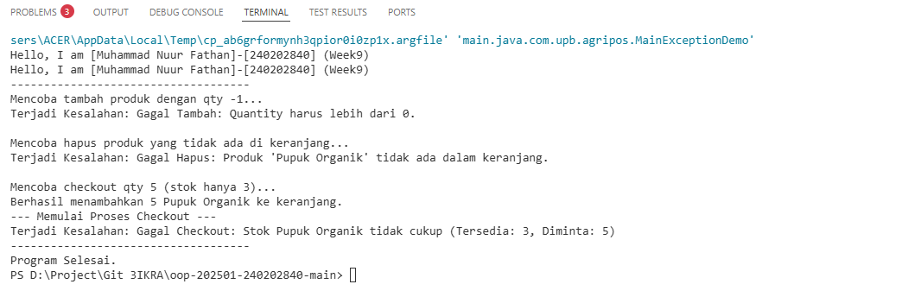

# Laporan Praktikum Minggu 9
Topik:  **Exception Handling, Custom Exception, dan Penerapan Design Pattern**

## Identitas
- Nama  : [Muhammad Nuur Fathan]
- NIM   : [240202840]
- Kelas : [3IKRA]
---

## Tujuan
1. Mahasiswa mampu membedakan antara Error dan Exception dalam Java.
2. Mahasiswa dapat mengimplementasikan blok `try–catch–finally` untuk menangani kesalahan program.
3. Mahasiswa mampu membuat dan menggunakan **Custom Exception** untuk validasi spesifik pada aplikasi Agri-POS.
4. Mahasiswa memahami integrasi penanganan kesalahan dalam logika bisnis keranjang belanja.


---

## Dasar Teori
1. **Error vs Exception:** Error adalah masalah fatal yang tidak bisa ditangani program (seperti `OutOfMemoryError`), sedangkan Exception adalah kondisi tidak normal yang masih bisa diantisipasi dan ditangani.
2. **Try-Catch-Finally:** Struktur untuk mencoba kode (`try`), menangkap kesalahan (`catch`), dan menjalankan kode pembersihan yang selalu dieksekusi (`finally`).
3. **Custom Exception:** Class exception yang dibuat sendiri dengan mewarisi (extends) class `Exception` untuk memberikan pesan kesalahan yang lebih spesifik bagi domain bisnis.
4. **Throwing Exception:** Menggunakan kata kunci `throw` untuk melempar exception secara eksplisit ketika validasi gagal.

---

## Langkah Praktikum
1. **Setup Package:** Membuat package `com.upb.agripos`.
2. **Pembuatan Custom Exception:** Membuat tiga class exception: `InvalidQuantityException`, `ProductNotFoundException`, dan `InsufficientStockException`.
3. **Pembuatan Model:** Membuat class `Product` untuk menyimpan data barang dan stok.
4. **Logika Bisnis:** Mengimplementasikan class `ShoppingCart` yang memiliki metode dengan validasi `throws`.
5. **Demo Program:** Membuat class `MainExceptionDemo` untuk menguji berbagai skenario kesalahan menggunakan blok `try-catch`.
6. **Commit:** Melakukan commit dengan pesan `week9-exception: [fitur] [deskripsi]`.

---

## Kode Program

InvalidQuantityException.java
```java
package main.java.com.upb.agripos;

public class InsufficientStockException extends Exception {
    public InsufficientStockException(String message) {
        super(message);
    }
}
```
MainExceptionDemo.java

```java
package main.java.com.upb.agripos;

public class MainExceptionDemo {
    @SuppressWarnings("UseSpecificCatch")
    public static void main(String[] args) {
        // 1. Identitas (Wajib sesuai tugas)
        System.out.println("Hello, I am [Muhammad Nuur Fathan]-[240202840] (Week9)");
        System.out.println("------------------------------------");

        // 2. Inisialisasi Objek secara langsung (Tanpa Service)
        ShoppingCart cart = new ShoppingCart();
        Product p1 = new Product("P01", "Pupuk Organik", 25000, 3);

        // 3. Uji Coba InvalidQuantityException
        try {
            System.out.println("Mencoba tambah produk dengan qty -1...");
            cart.addProduct(p1, -1);
        } catch (InvalidQuantityException e) {
            System.out.println("Terjadi Kesalahan: " + e.getMessage());
        }

        // 4. Uji Coba ProductNotFoundException
        try {
            System.out.println("\nMencoba hapus produk yang tidak ada di keranjang...");
            cart.removeProduct(p1);
        } catch (ProductNotFoundException e) {
            System.out.println("Terjadi Kesalahan: " + e.getMessage());
        }

        // 5. Uji Coba InsufficientStockException
        try {
            System.out.println("\nMencoba checkout qty 5 (stok hanya 3)...");
            cart.addProduct(p1, 5);
            cart.checkout();
        } catch (Exception e) {
            // Menangkap semua jenis exception yang mungkin terjadi saat checkout
            System.out.println("Terjadi Kesalahan: " + e.getMessage());
        } finally {
            System.out.println("------------------------------------");
            System.out.println("Program Selesai.");
        }
    }
}

```

Product.java

```java
package main.java.com.upb.agripos;

public class Product {
    private final String code;
    private final String name;
    private final double price;
    private int stock;

    public Product(String code, String name, double price, int stock) {
        this.code = code;
        this.name = name;
        this.price = price;
        this.stock = stock;
    }

    public String getCode() { return code; }
    public String getName() { return name; }
    public double getPrice() { return price; }
    public int getStock() { return stock; }
    
    public void reduceStock(int qty) {
        this.stock -= qty;
    }

    @Override
    public String toString() {
        return name + " (Stok: " + stock + ")";
    }
}
```

ProductNotFoundException.java

```java
package main.java.com.upb.agripos;

public class ProductNotFoundException extends Exception {
    public ProductNotFoundException(String message) {
        super(message);
    }
}
```
ShoppingCart.java

```java
package main.java.com.upb.agripos;

import java.util.HashMap;
import java.util.Map;

public class ShoppingCart {
    private final Map<Product, Integer> items = new HashMap<>();

    public void addProduct(Product p, int qty) throws InvalidQuantityException {
        if (qty <= 0) {
            throw new InvalidQuantityException("Gagal Tambah: Quantity harus lebih dari 0.");
        }
        items.put(p, items.getOrDefault(p, 0) + qty);
        System.out.println("Berhasil menambahkan " + qty + " " + p.getName() + " ke keranjang.");
    }

    public void removeProduct(Product p) throws ProductNotFoundException {
        if (!items.containsKey(p)) {
            throw new ProductNotFoundException("Gagal Hapus: Produk '" + p.getName() + "' tidak ada dalam keranjang.");
        }
        items.remove(p);
        System.out.println("Berhasil menghapus " + p.getName() + " dari keranjang.");
    }

    public void checkout() throws InsufficientStockException {
        System.out.println("--- Memulai Proses Checkout ---");
        // Validasi ketersediaan stok untuk semua barang
        for (Map.Entry<Product, Integer> entry : items.entrySet()) {
            Product product = entry.getKey();
            int qtyInCart = entry.getValue();
            
            if (product.getStock() < qtyInCart) {
                throw new InsufficientStockException(
                    "Gagal Checkout: Stok " + product.getName() + 
                    " tidak cukup (Tersedia: " + product.getStock() + ", Diminta: " + qtyInCart + ")"
                );
            }
        }

        // Jika semua stok cukup, baru kurangi stok asli
        for (Map.Entry<Product, Integer> entry : items.entrySet()) {
            entry.getKey().reduceStock(entry.getValue());
        }
        
        items.clear();
        System.out.println("Checkout Berhasil! Stok produk telah diperbarui.");
    }
}
```
---

## Hasil Eksekusi
  


---

## Analisis
* **Alur Program:** Program berjalan dengan mencoba memasukkan data. Saat program menemui perintah `throw`, alur normal dihentikan dan langsung melompat ke blok `catch` yang sesuai.
* **Pendekatan:** Berbeda dengan minggu sebelumnya yang mungkin menggunakan `if-else` sederhana untuk mencetak error, minggu ini kita menggunakan mekanisme Exception yang memungkinkan pemisahan antara logika bisnis dan logika penanganan kesalahan.
* **Kendala:** Memastikan semua exception yang bertipe *checked exception* sudah dideklarasikan dengan kata kunci `throws` pada signature method. Solusinya adalah selalu menambahkan `throws` atau membungkusnya dengan `try-catch`.

---

## Kesimpulan
Dengan menerapkan *Exception Handling*, aplikasi Agri-POS menjadi lebih robust (tangguh). Program tidak langsung *crash* saat terjadi kesalahan input, melainkan memberikan pesan informatif yang dapat dimengerti oleh pengguna.

---

## Quiz
1. **Jelaskan perbedaan error dan exception.**
* **Jawaban:** Error bersifat fatal dan berhubungan dengan lingkungan runtime (JVM), biasanya tidak disarankan untuk ditangkap. Exception berhubungan dengan logika program dan sangat disarankan untuk ditangani agar program tetap berjalan.


2. **Apa fungsi finally dalam blok try–catch–finally?**
* **Jawaban:** `finally` digunakan untuk mengeksekusi kode yang harus tetap berjalan baik terjadi exception maupun tidak, contohnya seperti menutup koneksi database atau membersihkan cache.


3. **Mengapa custom exception diperlukan?**
* **Jawaban:** Agar pesan kesalahan lebih spesifik terhadap kasus bisnis tertentu (misal: "Stok Kurang") daripada hanya menggunakan exception umum seperti `Exception` atau `RuntimeException`.


4. **Berikan contoh kasus bisnis dalam POS yang membutuhkan custom exception.**
* **Jawaban:** Validasi limit hutang pelanggan, validasi diskon yang sudah kadaluwarsa, atau validasi hak akses kasir saat mencoba melakukan void transaksi.
